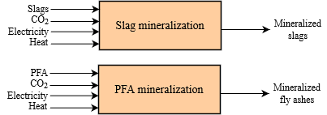

# CO2 mineralization

Two mineralization options are available in TIAM-FR, the mineralization of steel slags and pulverized fly ashes.

Carbon mineralization refers to the inorganic reaction that transforms gaseous CO2 into solid carbonates. The transformation is considered permanent since the decomposition of carbonates cannot occur without considerable energy input, and because carbonates are thermodynamically stable. Besides, carbonates are environmentally benign (NPC, 2019c). A typical carbonation reaction consists in reacting a metal oxide (MO) with CO2:

$$
MO+CO2→MCO_3+heat
$$

In nature, this chemical reaction rarely occurs due to the elevated temperatures required. In TIAM-FR, either steel slags or pulverized fly ashes can be mineralized with along with electricity and heat to operate the mineralization process, as shown in Figure 2. The techno-economic properties are extracted from (NASEM, 2019).

Fig. 2: Commodity flows of mineralization processes in TIAM-FR

### Mineralization of steel slags

### Mineralization of pulverized fly ashes

**References**

