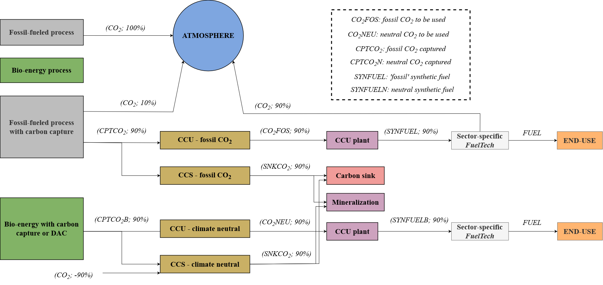

# CO2 accounting

As the environmental impact of CCS and CCU is very dependent on the nature of the carbon – fossil or climate-neutral – the modeling developed in TIAM-FR ensures transparent accounting of CO2 emissions in which each sector is responsible only for its direct emissions, illustrated in the figure below.

Fig. 1: Accounting of CO2 fluxes in TIAM-FR

Regardless the fossil resource powering a process, all the carbon within that resource is emitted as CO2 into the atmosphere. When the process incorporates a carbon capture unit, a certain proportion of the carbon is released due to imperfect capture efficiency (90% or 60% dependig on the process). However, the amount of the captured CO2 (CPTCO2) is directed to dummy processes (depicted in yellow in Figure 2). The solver decides whether this CO2 is used or stored. These sector-specific dummy processes efficiently aggregate the bulk of captured CO2 into two commodities for storage (SNKCO2) or utilization (CO2FOS).

On one hand, the CCUFOS commodity is transformed by the CCU plant into a fuel (SYNFUEL) containing fossil carbon (90% of the initial amount). It undergoes processing by a sector-specific *FuelTech* before being utilized in the end-use process. In TIMES modeling, *FuelTechs*, or Fuel Technologies, prevent duplicating end-use processes based on the type of fuel they consume. For instance, the model includes a *FuelTech* named FT_TRAMET (Figure 2), handling two methanol commodities (fossil methanol ALCMET and carbon-neutral methanol ALCMETB) to produce a single methanol commodity (TRAMET) for end-use processes in the transport sector (TRA), such as trucks and light vehicles. At this stage of the reference energy system (RES), the reemitted CO2 is allocated to the sector responsible for its emission, following the fuel's emissions factor.

  
Fig. 2: Example of a FuelTech for the transport sector and the methanol commodity

In this manner, the 90% CO2 that has been prevented by the capture unit is ultimately released into the atmosphere at the *FuelTech* level. Conversely, the CO2 earmarked for storage (SNKCO2) can be directed to onshore (SINKON), offshore (SINKOFF), or mineralized (CCUS) storage processes, contingent on regional storage capacity and costs. Consequently, the 90%  CO2 avoided at the capture unit is securely sealed.

In instances where the captured carbon is climate-neutral, whether atmospheric or biogenic, the accounting for CO2 emissions differs slightly. When a process is fueled by bioenergy, emissions are accounted for as zero, notwithstanding potential indirect greenhouse gas emissions linked to land use change or biomass harvesting that may be attributed to an upstream sector. In scenarios where a process is fueled by biomass and equipped with a carbon capture unit, direct emissions remain absent. Nevertheless, 90% of the CO2 flue gas is captured (CPTCO2B) and similarly directed to dummy processes. If the CO2 is utilized, it is consolidated into a singular commodity (CO2NEU), symbolizing a CO2 flux environmentally benign due to its origin. This CO2 commodity can be employed by any Carbon Capture and Utilization (CCU) plant, but when processed by the *FuelTech*, it generates a fuel (SYNFUELB) with zero CO2 emissions, ensuring that the utilized CO2 has no direct environmental impact.

However, if the climate-neutral CO2 captured is destined for storage, the negative emissions are factored into the dummy processes. For every ton of CO2 captured from a specific sector, an equivalent amount of CO2 is subtracted from the emissions of that sector. This modeling framework guarantees that all CO2 emissions or reductions are appropriately attributed to the respective sector based on their scope 1.
The modeling of CO2 transport and storage in TIAM-FR is detailed in a [dedicated section](CO2-transport-and-storage.md).

