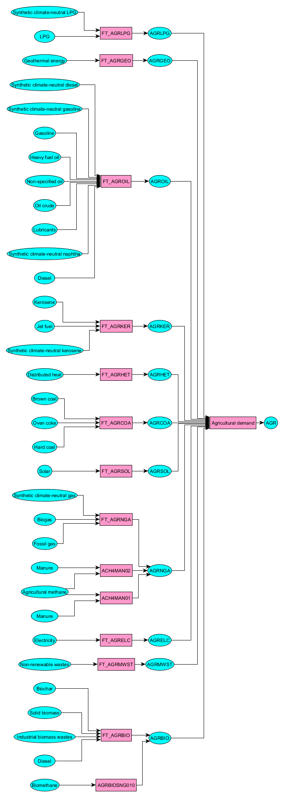

# Agriculture

The agricultural sector in TIAM-FR is not modeled with end-use technologies but only with end-use fuels comprising bioeenrgy, wastes, electricity, gas, solar, coal, distributed heat, kerosene, oil, geothermal energy and LPG, as defined by IEA energy balances (IEA, 2020). Thus, this sector can be decarbonized following IEA final end-use shares *via* a range of [synthetic fuels](./supply/synthetic-fuels.md), bioenergy (biogas, biomethane, biochar, bio-based wastes), solar, geothermal energy and by [methane abatement measures](../backstop/nonCO2.md) (recycling manure into biomethane). 

**References**

IEA, 2020. World Energy Balances – Analysis [WWW Document]. IEA. URL https://www.iea.org/reports/world-energy-balances-overview (accessed 3.14.22).
