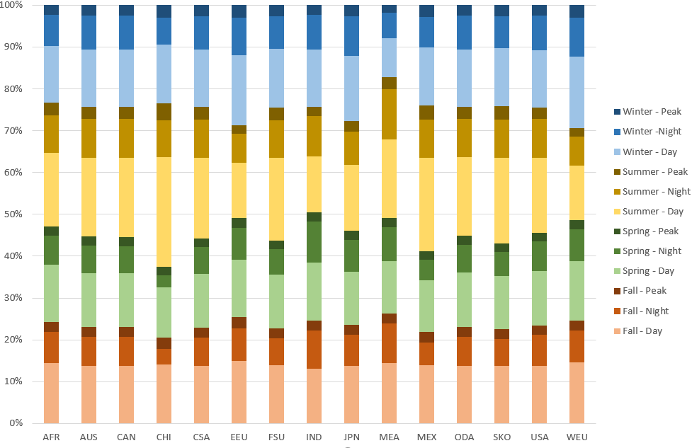
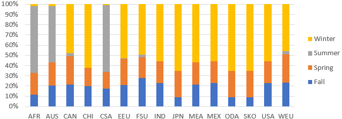

# Commercial

The commercial sector encompasses seven [energy demands](../demands/index.md) including space heating (CSH), space cooling (CSC), cooking (CCK), water heating (CHW), lighting (CLA), office equipments (COE), and other demands (COE). For each demand, the energy consumption in the base year is calibrated based on IEA energy balances (2020).The technologies and energies available in future years to satisfy energy demands are described in the following subsections.
The demand for commercial energy services varies according to the period of the year (Figure 1) and space heating works slightly differently from the rest of commercial energy demands (Figure 2).

  
Figure 1: Seasonal, [time-slice](../../time-representation/index.md) commercial energy demands in TIAM-FR across [regions](../../spatial-representation/index.md)  

  
Figure 2: Seasonal, [time-slice](../../time-representation/index.md) space heating energy demand in TIAM-FR across [regions](../../spatial-representation/index.md)  

**Technologies and energy carriers**

Commercial demand for lighting can be satisfied mostly by electricity through mercury lamps, incandescent lamps, halogen lamps, and different types of fluorescent lamps. Another traditional option is to use kerosene for lighting.
The main energy demand in the commercial sector is for heat supply or cooling depending on the region. For heating, there are numerous technologies including conventional electric resistances, as well as burners and boilers powered with oil, gas, coal or bioenegry. Alternative technologies include air-to-air and ground-to-air heat pumps, powered with grid electricity.  
Hot water can be satisifed by traditional water heaters supplied with diesel, kerosene, liquefied petroleum gas, fossil methane, coal and heavy fuel oil. Low-carbon water heaters include those supplied by solar, geothermal energy, bioenergy, distributed heat, or electricity, which can either be employed in a conventional heater equipped with a resistance or in heat pumps.
For cooling, either air-to-air or ground-to-air heat pumps can be invested and powered with grid electricity. Geothermal heat pumps are also available. Different kinds of chillers e.g. centrifugal, reciprocating, can also be powered by grid electricity, fossil gas and diesel.
Various energies can satisfy the commercial cooking demand: diesel, kerosene, liquefied petroleum gas, fossil gas, coal and heavy fuel oil, solar, geothermal enegry and electricity from the grid.

[Synthetic fuels](./supply/synthetic-fuels.md) made out of low-carbon [hydrogen](./supply/hydrogen.md) and [renewable carbon](../emissions/CO2-accounting.md) (atmospheric or biogenic) can supply the processes consuming oil or gas making the use of rather traditional processes less CO2 intensive. Hydrogen is not considered as an alternative fuel for this sector.

**References**
IEA, 2020. World Energy Balances – Analysis [WWW Document]. IEA. URL https://www.iea.org/reports/world-energy-balances-overview (accessed 3.14.22).
