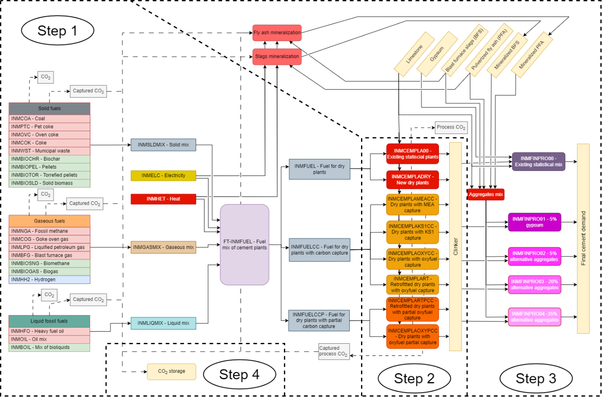

# Cement

Figure 1 represents the enhanced modeling of the cement industry in TIAM-FR, from energy commodities inputs to cement demand. The cement industry is disaggregated into four steps. The first one computes the optimal fuel mix to feed cement plants, considering substitution rates detailed in Table 1. The second one processes energy and limestone to produce clinker, that is processed in the third step with other aggregates to produce cement. For the base year (2018), the global cement industry is represented according to IEA’s energy balances (IEA, 2020a) for energy flows and cement demand. Regarding the clinker-to-cement ratio, several references listed in Table 2 are used to calculate the statistic energy efficiency of the existing assets (INMCEMPLA00) in 2018. The shares of aggregates (fly ash blast furnace slags, limestone, and gypsum) are assumed proportionally distributed across regions compared to the global average (IEA, 2020b). Due to lack of data, the material efficiency, the operational cost, and the fixed cost are set for every region to 1.26 tlimestone/tclinker, 21.9 $/tclinker, 1.29 $/tclinker (Griffin et al., 2013), but regional costs of limestone are taken from (Ferrari et al., 2019).

The energy consumption of the global cement industry is disaggregated for each regions of TIAM-FR according to the types of energy ; either solid fuels (coal, coke, pet coke, oven coke, municipal waste, biochar, wood biomass, pellets or torrefied pellets), gaseous fuels (natural gas, coke oven gas, liquefied petroleum gas, blast furnace gas, biogas or synthetic biomethane), or liquid fuels (heavy fuel oil, or a predefined mix of fossil (resp. bio-based) diesel and gasoline (INMOIL) (resp. INMBOIL)). This choice is made as the type of kilns and burners in cement plants depend on the state of energy used and other infrastructures such as storage tanks or pipelines that is difficult to consider in TIAM-FR. We isolate heat and electricity because these energy carriers cannot be used in conventional kilns, i.e. they require a substantial capital investment. If the fuels are ultimately processed in cement plants equipped with carbon capture units, the amount of CO2<\sub> captured is accounted at the same level of the RES. Once CO2<\sub> is captured, it can be either [stored](non-energy-sectors/co2-transport-and-storage.md) or converted into [synthetic fuels](supply/synthetic-fuels.md) or [minerals](backstop/mineralization.md).
Assuming that the lifetime of cement plants approximates 40 years (Cembureau, 2018a; IEA, 2020a), the remaining lifetime of current assets is evaluated in Table 3 for each region based on (IEA, 2020d). Thus, beyond 2018 and until current assets phase out, the model can satisfy part of the global cement demand with the existing assets. However, in the following subsections, we detail how TIAM-FR can decarbonize the cement industry by investing in new low-carbon cements plants, and by switching to low-carbon fuels and changing cement content.
