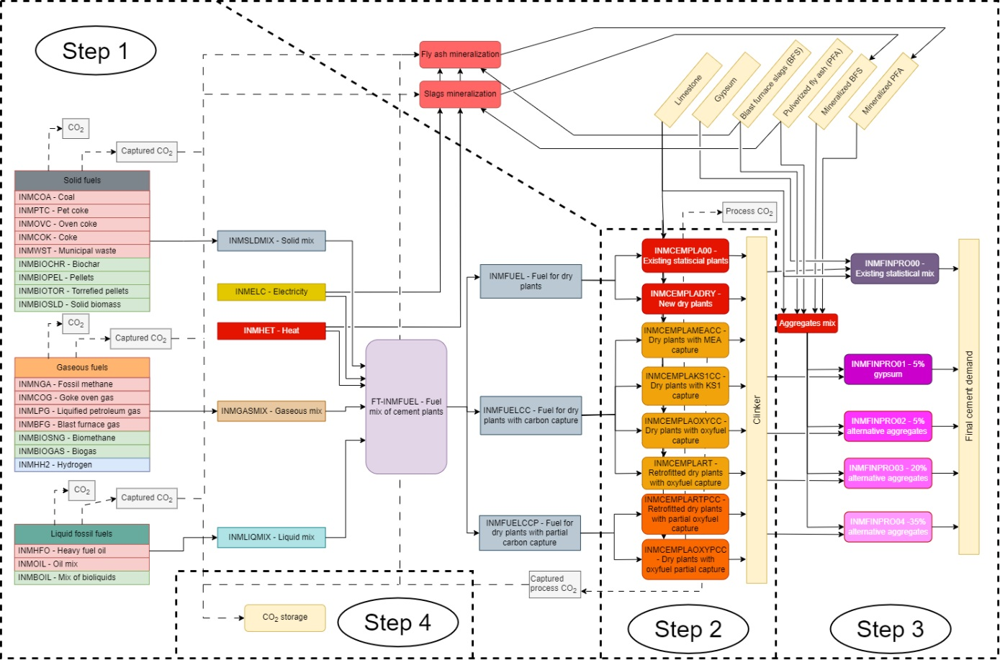

# Cement

The representation of cement production in TIAM-FR is - with [iron and steel](../iron-steel/index.md) - more explicit than the rest of the industry.  
Figure 1 represents the modeling of the cement industry in TIAM-FR, from energy commodities inputs to cement demand. The cement industry is disaggregated into four steps. The first one computes the optimal fuel mix to feed cement plants, considering substitution rates detailed in the subsequent section. The second one processes energy and limestone to produce clinker, that is processed in the third step with other aggregates to produce cement. For the base year, the global cement industry is represented according to IEA’s energy balances (IEA, 2020a) for energy flows and cement demand. Regarding the clinker-to-cement ratio, several references listed in Table 1 are used to calculate the statistic energy efficiency of the existing assets (INMCEMPLA00) in 2018. The shares of aggregates (fly ash blast furnace slags, limestone, and gypsum) are assumed proportionally distributed across regions compared to the global average (IEA, 2020b).The material efficiency, the operational cost, and the fixed cost are set for every region to 1.26 tlimestone/tclinker, \$ 21.9 /tclinker, 1.29 \$/tclinker (Griffin et al., 2013). Regional costs of limestone are taken from (Ferrari et al., 2019).

  
Figure 1: Reference energy system of the cement sector

The energy consumption of the global cement industry is disaggregated for each regions of TIAM-FR according to the types of energy; either solid fuels (coal, coke, pet coke, oven coke, municipal waste, biochar, wood biomass, pellets or torrefied pellets), gaseous fuels (natural gas, coke oven gas, liquefied petroleum gas, blast furnace gas, biogas or synthetic biomethane), or liquid fuels (heavy fuel oil, or a predefined mix of fossil (resp. bio-based) diesel and gasoline (INMOIL) (resp. INMBOIL)). This choice is made as the type of kilns and burners in cement plants depend on the state of energy used and other infrastructures such as storage tanks or pipelines that is difficult to consider in TIAM-FR. We isolate heat and electricity because these energy carriers cannot be used in conventional kilns, i.e. they require a substantial capital investment. If the fuels are ultimately processed in cement plants equipped with carbon capture units, the amount of CO2 captured is accounted at the same level of the RES. Once CO2 is captured, it can be either [stored](../../../backstop/CO2-transport-and-storage.md) or converted into [synthetic fuels](../../supply/synthetic-fuels.md) or [minerals](/backstop/mineralization.md).  
Assuming that the lifetime of cement plants approximates 40 years (Cembureau, 2018a; IEA, 2020a), the remaining lifetime of current assets is evaluated in Table 2 for each region based on (IEA, 2020d).

Table 1: clinker-to-cement ratio in the base-year across [regions](../../spatial-represenation.md) of TIAM-FR
| **Region** | **Clinker-to-cement ratio** | **Reference**                        |
| ---------- | --------------------------- | ------------------------------------ |
| **AFR**    | 75%                         | (IEA, 2017)                          |
| **AUS**    | 84%                         | (Global Cement, 2022)                |
| **CAN**    | 83%                         | (Cement Association of Canada, 2010) |
| **CHI**    | 65%                         | (IEA, 2020d)                         |
| **CSA**    | 71%                         | (Rowland, 2021)                      |
| **EEU**    | 82%                         | (IEA, 2017)                          |
| **FSU**    | 85%                         | (IEA, 2017)                          |
| **IND**    | 73%                         | (Rowland, 2021)                      |
| **JPN**    | 83%                         | (Taiheiyo Cement, n.d.)              |
| **MEA**    | 80%                         | (IEA, 2017)                          |
| **MEX**    | 77%                         | (Rowland, 2021)                      |
| **ODA**    | 78%                         | (IEA, 2017)                          |
| **SKO**    | 92%                         | (Andrew, 2019)                       |
| **USA**    | 89%                         | (Rowland, 2021)                      |
| **WEU**    | 74%                         | (Cembureau, 2018b)                   |

Table 2: Remaining lifetime of existing assets across [regions](../../spatial-represenation.md) of TIAM-FR
| **AFR** | **AUS** | **CAN** | **CHI** | **CSA** | **EEU** | **FSU** | **IND** | **JPN** | **MEA** | **MEX** | **ODA** | **SKO** | **USA** | **WEU** |
| ------- | ------- | ------- | ------- | ------- | ------- | ------- | ------- | ------- | ------- | ------- | ------- | ------- | ------- | ------- |
| 26      | 26      | 22      | 28      | 24      | 27      | 21      | 27      | 18      | 26      | 24      | 26      | 26      | 21      | 27      |

## Fuel-switching measures

Fuel-switching measures enables current and future cement plants to employ low-carbon energies and energy carriers such as hydrogen, electricity and bioenergy instead of fossil fuels. To trace realistic transition pathways, fuel input shares are constrained to lower and upper bounds from observed regional fuel shares in the base year. From 2018 to 2025, it is assumed that the fuel shares in cement plants remain constant across regions, but these constraints are relaxed onwards.  
Firstly, the cement industry can substitute between solid, gaseous and liquid fuel by a factor of 33% every 10 years as of 2030 until 2050, i.e. each region is free to use 33% more or 33% less solid, gaseous, or liquid fuels as of 2030 onwards. Bioliquids, biomethane and biochar are considered as perfect substitutes to fossil gases, fossil liquids and fossil solids respectively (Anand et al., 2023; Ardolino et al., 2021). Nonetheless, their substitution rate grows linearly until 100% in 2050 to ensure a realistically progressive replacement. As for solid biomass, pellets and torrefied pelleted, the substitution rate grow linearly until 80% in 2050, as it corresponds to the maximum rate found in the literature (Cavalett et al., 2022), and because these solid biofuels show a lower heating value (LHV) that cannot substitute coal products, while biochar can. Likewise, biogas substitution rate as the ratio of its LHV of 6.5 kWh/m3 against the one of fossil gas (11 kWh/Nm3) which makes 59%. The small retrofitting investments required to convert a process consuming fossil fuels into a process consuming biofuels are neglected (ECRA, 2017; McKinsey&Company, 2018).
Secondly, for heat and electricity, an upper bounds are set empirically for every region that corresponds to the maximum electricity share observed in 2018 multiplied by 133% to provide room for improvement. This constraint aims to reflect that the feasibility of changing the phase of the fuel employed in kilns is limited and requires costly adjustments (Turnell, 2000). Hydrogen maximum input share is defined as 5%, 10%, and 15% of gaseous mix respectively in 2030, 2040 and 2050 pipeline (Di Lullo et al., 2021; Mahajan et al., 2022). Indeed, these energies cannot fully substitute fossil fuels, as burning hydrogen (H2) to generate high temperatures in the kiln requires significant capital investment; because of differences in heat transfers, the kiln and the burners needs to be redesigned (McKinsey&Company, 2018). Likewise, electricity is not a perfect substitute for coal, gas or liquids in existing kiln, although it is – and can be – used for other purposes in cement plants e.g., for grinding limestone, forklifts, or other electric devices. As for municipal waste, its is assumed that the maximum utilization rate of municipal waste in cement plants for all regions in 2025 onwards equals the maximum share of municipal waste observed in the base year – which is 7.3% in Eastern Europe – multiplied by 133%.

## Technological solutions

In addition to the existing wet and dry plants, new cement plants are available representing different types of kiln and different CO2 capture types. The scope of the cement plant modeled in TIAM-FR includes limestone grinding, coal grinding – or fuel conditioning, pulp mill, heaters and pre-heaters, the kiln, the cooler, and clinker grinding. Two cases are distinguished for CO2 capture: post-combustion and oxy-combustion. For post-combustion capture, two types of solvent are considered, i.e. monoethanolamine (MEA) and KS-1. The former is the most common chemical for CO2 capture, and has been used for decades, while the latter has gained interest as it requires less energy to regenerate, with a longer lifespan and a higher CO2 uptake (DOE, 2017; Global CCS Institute, 2021; Ho et al., 2009), but at higher cost (Griffin et al., 2013). Two dry kilns equipped with MEA-based post-combustion capture (INMCEMPLAMEACC), and KS1-based post-combustion capture (INMCEMPLAKS1) are considered in TIAM-FR.  
The oxy-combustion technique is worth considering for the cement industry. This technique requires an Air Separation Unit (ASU) to provide the oxygen to the fuel, emitting almost pure CO2. Two options are available: either partial oxy-combustion, only to the calciner, or full oxy-combustion, to the whole kiln, thus covering both process and combustion CO2 emissions. The partial capture covers approximately 60% of the emissions (ECRA, 2017; Griffin et al., 2013). Dry kilns equipped with partial oxy-combustion capture (INMCEMPLAOXYPCC) are thus distinguished from dry kilns equipped with full oxy-combustion capture (INMCEMPLAOXYCC). The techno-economic assumptions were extracted from (CEMCAP, 2016; ECRA, 2017; Griffin et al., 2013) and are gathered in Table 1 and Table 2.

Table 1: Techno-economic properties of cement plants (unit: ton of clinker) for various processes
| **Process**                                                 | **CAPEX** | **FIXOM** | **VAROM** | **Lifespan** | **Start** |
| ----------------------------------------------------------- | --------- | --------- | --------- | ------------ | --------- |
| **Units**                                                   | [$/t]     | [$/t]     | [$/t]     | [years]      |           |
| **Wet process**                                             | 392       | 22        | 1         | 32.5         | 2018      |
| **Dry process**                                             | 415       | 22        | 1         | 32.5         | 2018      |
| **Dry process with amine CO2** **capture**                  | 653       | 32        | 1.3       | 27.5         | 2030      |
| **Dry process with KS1 CO2** **capture**                    | 653       | 53        | 1.3       | 27.5         | 2030      |
| **Dry process with partial oxyfuel capture**                | 653       | 38        | 1.3       | 27.5         | 2030      |
| **Dry process with oxyfuel capture**                        | 579       | 38        | 1.3       | 27.5         | 2030      |
| **Retrofitted existing plant with KS1 capture**             | 253       | 54        | 1.3       | 27.5         | 2030      |
| **Retrofitted existing plant with partial oxyfuel capture** | 67        | 33        | 1.3       | 27.5         | 2030      |

Table 2: Consumptions and emissions of cement plants (unit: ton of clinker) for various processes
| Row Labels                                              | Fuel | Oxygen | Process CO2 emitted | Process CO2 captured |
| ----------------------------------------------------------- | -------- | ---------- | --------------------------- | ---------------------------- |
| **Units**                                                   | [GJ/t]   | [t/t]      | [kg/t]                      | [kg/t]                       |
| **Wet process**                                             | 5.17     |            | 556                         |                              |
| **Dry process**                                             | 3.90     |            | 556                         |                              |
| **Dry process with amine CO2** **capture**                  | 9.64     |            | 56                          | 500                          |
| **Dry process with KS1 CO2** **capture**                    | 8.24     |            | 56                          | 500                          |
| **Dry process with partial oxyfuel capture**                | 4.57     | 0,16       | 222                         | 334                          |
| **Dry process with oxyfuel capture**                        | 5.27     | 0,26       | 56                          | 500                          |
| **Retrofitted existing plant with KS1 capture**             | 8.24     |            | 56                          | 500                          |
| **Retrofitted existing plant with partial oxyfuel capture** | 4.57     | 0.16       | 222                         | 334                          |

The annual availability factor is set at 90% and material input is 1.26 tlimestone/tclinker for every process. Any new capacities installed show a discount rate of 10%. Finally, retrofitting options are included for existing cement plants based on (Griffin et al., 2013), accounting for the energy penalty and additional costs of retrofitting an existing dry plant. The emissions from combustion CO2 and the possible amounts of CO2 captured are not shown here as they are endogenously determined according to the energy mix chosen by the optimization. The amount of CO2 captured from cement processes in 2030 is constrained base on existing projects and their announced operational date (IEA, 2024).

## Clinker reduction measures

Different finishing processes are implemented in the model. They refer to the final process that converts clinker into commercial cement by blending clinker with a mix of aggregates. The conventional finishing process refers to the transformation of clinker into Ordinary Portland Cement (OPC), which consists in grinding and mixing clinker with gypsum, respectively by 95%wt and 5%wt (Fazio and Pennington, 2006). Thus, the finished cement is highly clinker-intensive, but an alternative finishing process consists in reducing the clinker-to-cement ratio and blending with alternative aggregates such as blast furnace slag, mineralized fly ashes, and mineralized steel slags. The model chooses the optimal mix of aggregates to be blended with clinker, and clinker share in final cement is comprised between 5% to 35% (Figure 1).

**References**

IEA, 2020. World Energy Balances – Analysis [WWW Document]. IEA. URL https://www.iea.org/reports/world-energy-balances-overview (accessed 3.14.22).  
Andrew, R.M., 2019. GlobalCO2emissions from cement production, 1928–2018. Earth System Science Data 11, 1675–1710. https://doi.org/10.5194/essd-11-1675-2019  
Cembureau, 2018. Clinker Substitution [WWW Document]. Cembureau. URL https://lowcarboneconomy.cembureau.eu/5-parallel-routes/resource-efficiency/clinker-substitution/ (accessed 11.29.23).  
Cement Association of Canada, 2010. Canadian Cement Industry - Sustainability Report [WWW Document]. URL https://www.atlanticconcrete.ca/images/ENGLISH_FINAL_2010_SD_Report_Mar17.pdf (accessed 11.29.23).  
Global Cement, 2022. Slashing cement’sCO2emissions Down Under [WWW Document]. URL https://www.globalcement.com/news/item/14855-slashing-cement-s-co2-emissions-down-under (accessed 11.29.23).   
Rowland, J., 2021. A Net-Zero Cement and Concrete Industry – Cement Products. URL https://cementproducts.com/2021/09/18/a-net-zero-cement-and-concrete-industry/ (accessed 11.29.23).  
Taiheiyo Cement, n.d. ESG Data [WWW Document]. URL https://www.taiheiyo-cement.co.jp/english/csr/pdf/data/2022/rep_14.pdf (accessed 11.29.23).  
Griffin, P., Hammond, G., Norman, J., 2013. Industrial Energy Use from a Bottom-Up Perspective: Developing the Usable Energy Database (Beta version) 53.  
Ferrari, N., Mancuso, L., Burnard, K., Consonni, F., 2019. Effects of plant location on cost ofCO2capture. International Journal of Greenhouse Gas Control 90, 102783. https://doi.org/10.1016/j.ijggc.2019.102783  
IEA, 2020. CCUS in clean energy transitions. Energy Technology Perspectives 174.  
Cembureau, 2018. Thermal Energy Efficiency [WWW Document]. Cembureau. URL https://lowcarboneconomy.cembureau.eu/5-parallel-routes/energy-efficiency/thermal-energy-efficiency/ (accessed 11.30.23).    
IEA, 2020. Energy Technology Perspectives 2020. Energy Technology Perspectives.  
CEMCAP, 2016. Design and performance of CEMCAP cement plant with MEA post combustion capture.  
ECRA, 2017. CSI/ECRATechnology Papers 2017, Cement Sustainability Initiative, Ed. Development of State of the Art-echniques in Cement Manufacturing: Trying to Look Ahead. Duesseldorf, Geneva.  
IEA, n.d. CCUS Projects Database - Data product [WWW Document]. IEA. URL https://www.iea.org/data-and-statistics/data-product/ccus-projects-database (accessed 4.4.24).  
Fazio, S., Pennington, D., 2006. Portland cement (CEM I); CEMBUREAU technology mix, EN 197-1; CEMBUREAU production mix, at plant (Location: RER).  
