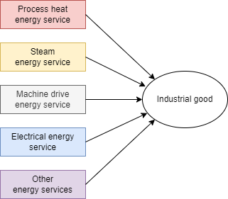

# Industry

The industry sector englobes several industries:
+ the non-metal industry, notably the cement industry
+ the iron and steel industry
+ the pulp and paper industry
+ the chemical industry
+ the non-ferrous industry, notably the aluminum industry
+ other industries including tobacco, food, automotive, textile, etc.

In TIAM-FR, the [cement](./cement/index.md) industry and the [iron & steel](./iron-steel/index.md) industry are represented explicitly (Desport, 2023) while the rest of the industry follows a generic bottom-up description of industrial energy-service demands including process heat, steam, machinery, feedstocks, electricity, and others, as described in (Fais et al., 2019) and Figure 1. The reciepe shows in the figure below features different energy shares between energy services depending on the region and the industrial good manufactured. These shares and net amount are captured by the IEA energy balance (2020) and implemented in TIAM-FR for the base-year.

Figure 1: The reciepe for producing industrial goods in TIAM-FR  

The model chooses which energy are the most competitive to deliver these energy demands, and it is possible to invest in new, more efficient industrial assets to improve the performance of the industry. The techno-economic assumptions for these processes are given in Table 1.

Table 1: Techno-economic properties of industrial energy-service processes in TIAM-FR
| Sector         | Energy service | Energy                  | Innovation            | CAPEX  | FIXOM | VAROM | Efficiency | Market share | Avaialbility factor |
| -------------- | -------------- | ----------------------- | --------------------- | ------ | ----- | ----- | ---------- | ------------ | ------------------- |
| Unit           |                |                         |                       | $/GJ   | $/GJ  | $/GJ  | GJ/GJ      | %            | %                   |
| Chemicals      | Electrical     | Electricity             | Existing technologies | 12,50  | 0,70  | 0     | 0,91       | 0,99         | 0,80                |
| Chemicals      | Electrical     | Electricity             | New technologies      | 11,00  | 0,90  | 0     | 0,91       | 0            | 0,80                |
| Chemicals      | Feedstocks     | Asphalt                 | Existing technologies | 0      | 0     | 0     | 1,00       | 0,00         | 1,00                |
| Chemicals      | Feedstocks     | Blast furnace gas       | Existing technologies | 0      | 0     | 0     | 1,00       | 0,00         | 1,00                |
| Chemicals      | Feedstocks     | Coke oven gas           | Existing technologies | 0      | 0     | 0     | 1,00       | 0,00         | 1,00                |
| Chemicals      | Feedstocks     | Crude oil               | Existing technologies | 0      | 0     | 0     | 1,00       | 0,00         | 1,00                |
| Chemicals      | Feedstocks     | Distillates             | Existing technologies | 1,09   | 0     | 0     | 1,11       | 0,00         | 0,80                |
| Chemicals      | Feedstocks     | Distillates             | New technologies      | 0,96   | 0     | 0     | 1,11       | 0            | 0,80                |
| Chemicals      | Feedstocks     | Ethane                  | Existing technologies | 1,09   | 0     | 0     | 1,11       | 0,00         | 0,80                |
| Chemicals      | Feedstocks     | Ethane                  | New technologies      | 0,96   | 0     | 0     | 1,11       | 0            | 0,80                |
| Chemicals      | Feedstocks     | Gasoline                | Existing technologies | 0      | 0     | 0     | 1,00       | 0,00         | 1,00                |
| Chemicals      | Feedstocks     | Hardcoal                | Existing technologies | 0      | 0     | 0     | 1,00       | 0,06         | 1,00                |
| Chemicals      | Feedstocks     | Heavy fuel oil          | Existing technologies | 1,09   | 0     | 0     | 1,11       | 0,00         | 0,80                |
| Chemicals      | Feedstocks     | Heavy fuel oil          | New technologies      | 0,96   | 0     | 0     | 1,11       | 0            | 0,80                |
| Chemicals      | Feedstocks     | Kerosene                | Existing technologies | 0      | 0     | 0     | 1,00       | 0,00         | 1,00                |
| Chemicals      | Feedstocks     | Liquefied petroleum gas | Existing technologies | 1,09   | 0     | 0     | 1,11       | 0,00         | 0,80                |
| Chemicals      | Feedstocks     | Liquefied petroleum gas | New technologies      | 0,96   | 0     | 0     | 1,11       | 0            | 0,80                |
| Chemicals      | Feedstocks     | Naphtha                 | Existing technologies | 1,09   | 0     | 0     | 1,11       | 0,06         | 0,80                |
| Chemicals      | Feedstocks     | Naphtha                 | New technologies      | 0,96   | 0     | 0     | 1,11       | 0            | 0,80                |
| Chemicals      | Feedstocks     | Gas                     | Existing technologies | 1,09   | 0     | 0     | 1,11       | 0,88         | 0,80                |
| Chemicals      | Feedstocks     | Gas                     | New technologies      | 0,96   | 0     | 0     | 1,11       | 0            | 0,80                |
| Chemicals      | Feedstocks     | Gas liquids             | Existing technologies | 1,09   | 0     | 0     | 1,11       | 0,00         | 0,80                |
| Chemicals      | Feedstocks     | Gas liquids             | New technologies      | 0,96   | 0     | 0     | 1,11       | 0            | 0,80                |
| Chemicals      | Feedstocks     | Oil non-specified       | Existing technologies | 0      | 0     | 0     | 1,00       | 0,00         | 1,00                |
| Chemicals      | Feedstocks     | Oven coke               | Existing technologies | 0      | 0     | 0     | 1,00       | 0,00         | 1,00                |
| Chemicals      | Feedstocks     | Petroleum coke          | Existing technologies | 0      | 0     | 0     | 1,00       | 0,00         | 1,00                |
| Chemicals      | Feedstocks     | Refinery gas            | Existing technologies | 0      | 0     | 0     | 1,00       | 0,00         | 1,00                |
| Chemicals      | Feedstocks     | Coal tar                | Existing technologies | 0      | 0     | 0     | 1,00       | 0,00         | 1,00                |
| Chemicals      | Machine drive  | Electricity             | Existing technologies | 2,28   | 0,13  | 0     | 0,90       | 0,98         | 0,25                |
| Chemicals      | Machine drive  | Electricity             | New technologies      | 2,01   | 0,16  | 0     | 0,90       | 0            | 0,25                |
| Chemicals      | Machine drive  | Liquefied petroleum gas | Existing technologies | 12,50  | 0,70  | 0     | 0,40       | 0,01         | 0,25                |
| Chemicals      | Machine drive  | Liquefied petroleum gas | New technologies      | 11,00  | 0,90  | 0     | 0,40       | 0            | 0,25                |
| Chemicals      | Others         | Bioenergy               | Existing technologies | 3,86   | 0,37  | 0     | 0,91       | 0,06         | 0,80                |
| Chemicals      | Others         | Bioenergy               | New technologies      | 3,39   | 0,48  | 0     | 0,91       | 0            | 0,80                |
| Chemicals      | Others         | Electricity             | Existing technologies | 3,47   | 0,31  | 0     | 1,11       | 0,93         | 0,80                |
| Chemicals      | Others         | Electricity             | New technologies      | 3,06   | 0,39  | 0     | 1,11       | 0            | 0,80                |
| Chemicals      | Others         | Petroleum coke          | Existing technologies | 0      | 0     | 0     | 1,00       | 0,00         | 1,00                |
| Chemicals      | Process heat   | Biomethane              | Existing technologies | 1,09   | 0,15  | 0,15  | 0,90       | 0,00         | 0,80                |
| Chemicals      | Process heat   | Bioliquids              | Existing technologies | 1,46   | 0,21  | 0,15  | 0,89       | 0,00         | 0,80                |
| Chemicals      | Process heat   | Coking coal             | Existing technologies | 0      | 0     | 0     | 1,00       | 0,00         | 1,00                |
| Chemicals      | Process heat   | Heavy fuel oil          | Existing technologies | 1,55   | 0,15  | 0,15  | 0,89       | 0,01         | 0,80                |
| Chemicals      | Process heat   | Heavy fuel oil          | New technologies      | 1,36   | 0,20  | 0,19  | 0,89       | 0            | 0,80                |
| Chemicals      | Process heat   | Liquefied petroleum gas | Existing technologies | 3,68   | 0,38  | 0     | 0,81       | 0,02         | 0,80                |
| Chemicals      | Process heat   | Liquefied petroleum gas | New technologies      | 3,24   | 0,50  | 0     | 0,81       | 0            | 0,80                |
| Chemicals      | Process heat   | Gas                     | Existing technologies | 1,09   | 0,15  | 0,15  | 0,90       | 0,96         | 0,80                |
| Chemicals      | Process heat   | Gas                     | New technologies      | 0,96   | 0,20  | 0,19  | 0,90       | 0            | 0,80                |
| Chemicals      | Process heat   | Oil                     | Existing technologies | 1,46   | 0,21  | 0,15  | 0,89       | 0,00         | 0,80                |
| Chemicals      | Process heat   | Oil                     | New technologies      | 1,29   | 0,27  | 0,19  | 0,89       | 0            | 0,80                |
| Chemicals      | Process heat   | Oven coke               | Existing technologies | 4,30   | 0,38  | 0     | 0,81       | 0,00         | 0,80                |
| Chemicals      | Process heat   | Oven coke               | New technologies      | 3,78   | 0,50  | 0     | 0,81       | 0            | 0,80                |
| Chemicals      | Process heat   | Wastes                  | Existing technologies | 4,30   | 0,38  | 0     | 0,81       | 0,00         | 0,80                |
| Chemicals      | Steam          | Blast furnace gas       | Existing technologies | 0      | 0     | 0     | 1,00       | 0,00         | 1,00                |
| Chemicals      | Steam          | Biomethane              | Existing technologies | 1,09   | 0,15  | 0,15  | 0,90       | 0,00         | 0,80                |
| Chemicals      | Steam          | Bioliquids              | Existing technologies | 1,46   | 0,21  | 0,15  | 0,89       | 0,00         | 0,80                |
| Chemicals      | Steam          | Coal                    | Existing technologies | 3,88   | 0,22  | 0     | 0,81       | 0,00         | 0,80                |
| Chemicals      | Steam          | Coal                    | New technologies      | 3,41   | 0,28  | 0     | 0,81       | 0            | 0,80                |
| Chemicals      | Steam          | Coke oven gas           | Existing technologies | 0      | 0     | 0     | 1,00       | 0,00         | 1,00                |
| Chemicals      | Steam          | Coking coal             | Existing technologies | 0      | 0     | 0     | 1,00       | 0,00         | 1,00                |
| Chemicals      | Steam          | Heat                    | Existing technologies | 0      | 0     | 0     | 1,00       | 0,00         | 1,00                |
| Chemicals      | Steam          | Heavy fuel oil          | Existing technologies | 1,55   | 0,15  | 0,15  | 0,89       | 0,02         | 0,80                |
| Chemicals      | Steam          | Heavy fuel oil          | New technologies      | 1,36   | 0,20  | 0,19  | 0,89       | 0            | 0,80                |
| Chemicals      | Steam          | Gas                     | Existing technologies | 1,09   | 0,15  | 0,15  | 0,90       | 0,95         | 0,80                |
| Chemicals      | Steam          | Gas                     | New technologies      | 0,96   | 0,20  | 0,19  | 0,90       | 0            | 0,80                |
| Chemicals      | Steam          | Oil                     | Existing technologies | 1,46   | 0,21  | 0,15  | 0,89       | 0,01         | 0,80                |
| Chemicals      | Steam          | Oil                     | New technologies      | 1,29   | 0,27  | 0,19  | 0,89       | 0            | 0,80                |
| Chemicals      | Steam          | Oven coke               | Existing technologies | 0      | 0     | 0     | 1,00       | 0,00         | 1,00                |
| Chemicals      | Steam          | Wastes                  | Existing technologies | 3,88   | 0,38  | 0     | 0,81       | 0,00         | 0,80                |
| Non-ferrous    | Electrical     | Electricity             | Existing technologies | 101,84 | 3,70  | 0     | 0,91       | 0,99         | 0,80                |
| Non-ferrous    | Electrical     | Electricity             | New technologies      | 89,62  | 4,75  | 0     | 0,91       | 0            | 0,80                |
| Non-ferrous    | Machine drive  | Electricity             | Existing technologies | 2,28   | 0,13  | 0     | 0,90       | 0,99         | 0,25                |
| Non-ferrous    | Machine drive  | Electricity             | New technologies      | 2,01   | 0,16  | 0     | 0,90       | 0            | 0,25                |
| Non-ferrous    | Others         | Electricity             | Existing technologies | 4,63   | 0,26  | 0     | 0,91       | 0,94         | 0,80                |
| Non-ferrous    | Others         | Electricity             | New technologies      | 4,07   | 0,33  | 0     | 0,91       | 0            | 0,80                |
| Non-ferrous    | Others         | Gas                     | Existing technologies | 3,32   | 0,19  | 0     | 0,91       | 0,02         | 0,80                |
| Non-ferrous    | Others         | Gas                     | New technologies      | 2,92   | 0,24  | 0     | 0,91       | 0            | 0,80                |
| Non-ferrous    | Others         | Petroleum coke          | Existing technologies | 0      | 0     | 0     | 1,00       | 0,02         | 1,00                |
| Non-ferrous    | Process heat   | Bioliquids              | Existing technologies | 1,46   | 0,21  | 0,15  | 0,89       | 0,00         | 0,80                |
| Non-ferrous    | Process heat   | Coal                    | Existing technologies | 3,88   | 0,22  | 0     | 0,81       | 0,83         | 0,80                |
| Non-ferrous    | Process heat   | Coal                    | New technologies      | 3,41   | 0,28  | 0     | 0,81       | 0            | 0,80                |
| Non-ferrous    | Process heat   | Coking coal             | Existing technologies | 0      | 0     | 0     | 1,00       | 0,00         | 1,00                |
| Non-ferrous    | Process heat   | Heavy fuel oil          | Existing technologies | 1,55   | 0,15  | 0,15  | 0,89       | 0,04         | 0,80                |
| Non-ferrous    | Process heat   | Heavy fuel oil          | New technologies      | 1,36   | 0,20  | 0,19  | 0,89       | 0            | 0,80                |
| Non-ferrous    | Process heat   | Liquefied petroleum gas | Existing technologies | 1,09   | 0,15  | 0,15  | 0,90       | 0,05         | 0,80                |
| Non-ferrous    | Process heat   | Liquefied petroleum gas | New technologies      | 0,96   | 0,20  | 0,19  | 0,90       | 0            | 0,80                |
| Non-ferrous    | Process heat   | Gas                     | Existing technologies | 1,09   | 0,15  | 0,15  | 0,90       | 0,07         | 0,80                |
| Non-ferrous    | Process heat   | Gas                     | New technologies      | 0,96   | 0,20  | 0,19  | 0,90       | 0            | 0,80                |
| Non-ferrous    | Process heat   | Oil                     | Existing technologies | 1,46   | 0,21  | 0,15  | 0,89       | 0,01         | 0,80                |
| Non-ferrous    | Process heat   | Oil                     | New technologies      | 1,29   | 0,27  | 0,19  | 0,89       | 0            | 0,80                |
| Non-ferrous    | Process heat   | Oven coke               | Existing technologies | 3,88   | 0,22  | 0     | 0,81       | 0,00         | 0,80                |
| Non-ferrous    | Process heat   | Oven coke               | New technologies      | 3,41   | 0,28  | 0     | 0,81       | 0            | 0,80                |
| Non-ferrous    | Steam          | Blast furnace gas       | Existing technologies | 0      | 0     | 0     | 1,00       | 0,00         | 1,00                |
| Non-ferrous    | Steam          | Bioenergy               | Existing technologies | 0      | 0     | 0     | 1,00       | 0,00         | 1,00                |
| Non-ferrous    | Steam          | Bioliquids              | Existing technologies | 1,46   | 0,21  | 0,15  | 0,89       | 0,00         | 0,80                |
| Non-ferrous    | Steam          | Coal                    | Existing technologies | 3,88   | 0,22  | 0     | 0,81       | 0,91         | 0,80                |
| Non-ferrous    | Steam          | Coal                    | New technologies      | 3,41   | 0,28  | 0     | 0,81       | 0            | 0,80                |
| Non-ferrous    | Steam          | Coke oven gas           | Existing technologies | 0      | 0     | 0     | 1,00       | 0,00         | 1,00                |
| Non-ferrous    | Steam          | Coking coal             | Existing technologies | 0      | 0     | 0     | 1,00       | 0,00         | 1,00                |
| Non-ferrous    | Steam          | Heat                    | Existing technologies | 0      | 0     | 0     | 1,00       | 0,00         | 1,00                |
| Non-ferrous    | Steam          | Heavy fuel oil          | Existing technologies | 1,55   | 0,15  | 0,15  | 0,89       | 0,05         | 0,80                |
| Non-ferrous    | Steam          | Heavy fuel oil          | New technologies      | 1,36   | 0,20  | 0,19  | 0,89       | 0            | 0,80                |
| Non-ferrous    | Steam          | Gas                     | Existing technologies | 1,09   | 0,15  | 0,15  | 0,90       | 0,03         | 0,80                |
| Non-ferrous    | Steam          | Gas                     | New technologies      | 0,96   | 0,20  | 0,19  | 0,90       | 0            | 0,80                |
| Non-ferrous    | Steam          | Oil                     | Existing technologies | 1,46   | 0,21  | 0,15  | 0,89       | 0,01         | 0,80                |
| Non-ferrous    | Steam          | Oil                     | New technologies      | 1,29   | 0,27  | 0,19  | 0,89       | 0            | 0,80                |
| Non-ferrous    | Steam          | Oven coke               | Existing technologies | 0      | 0     | 0     | 1,00       | 0,00         | 1,00                |
| Other industry | Machine drive  | Electricity             | Existing technologies | 2,28   | 0,13  | 0     | 0,85       | 0,99         | 0,25                |
| Other industry | Machine drive  | Electricity             | New technologies      | 2,01   | 0,16  | 0     | 0,85       | 0            | 0,25                |
| Other industry | Others         | Biomethane              | Existing technologies | 3,32   | 0,34  | 0     | 0,91       | 0,00         | 0,80                |
| Other industry | Others         | Electricity             | Existing technologies | 3,67   | 0,35  | 0     | 0,91       | 0,74         | 0,80                |
| Other industry | Others         | Electricity             | New technologies      | 3,23   | 0,46  | 0     | 0,91       | 0            | 0,80                |
| Other industry | Others         | Liquefied petroleum gas | Existing technologies | 0      | 0     | 0     | 1,00       | 0,00         | 1,00                |
| Other industry | Others         | Gas                     | Existing technologies | 3,32   | 0,34  | 0     | 0,91       | 0,00         | 0,80                |
| Other industry | Others         | Gas                     | New technologies      | 2,92   | 0,43  | 0     | 0,91       | 0            | 0,80                |
| Other industry | Others         | Oil                     | Existing technologies | 3,67   | 0,37  | 0     | 0,91       | 0,22         | 0,80                |
| Other industry | Others         | Oil                     | New technologies      | 3,23   | 0,48  | 0     | 0,91       | 0            | 0,80                |
| Other industry | Others         | Petroleum coke          | Existing technologies | 4,63   | 0,93  | 0     | 0,91       | 0,03         | 0,80                |
| Other industry | Others         | Petroleum coke          | New technologies      | 4,07   | 1,20  | 0     | 0,91       | 0            | 0,80                |
| Other industry | Process heat   | Biomethane              | Existing technologies | 1,09   | 0,15  | 0,15  | 0,90       | 0,00         | 0,80                |
| Other industry | Process heat   | Bioliquids              | Existing technologies | 1,46   | 0,21  | 0,15  | 0,89       | 0,00         | 0,80                |
| Other industry | Process heat   | Coal                    | Existing technologies | 3,88   | 0,22  | 0     | 0,81       | 0,10         | 0,80                |
| Other industry | Process heat   | Coal                    | New technologies      | 3,41   | 0,28  | 0     | 0,81       | 0            | 0,80                |
| Other industry | Process heat   | Coke oven gas           | Existing technologies | 0      | 0     | 0     | 1,00       | 0,00         | 1,00                |
| Other industry | Process heat   | Coking coal             | Existing technologies | 0      | 0     | 0     | 1,00       | 0,00         | 1,00                |
| Other industry | Process heat   | Electricity             | Existing technologies | 1,23   | 0,03  | 0,14  | 0,98       | 0,17         | 0,80                |
| Other industry | Process heat   | Electricity             | New technologies      | 1,08   | 0,04  | 0,18  | 0,98       | 0            | 0,80                |
| Other industry | Process heat   | Heavy fuel oil          | Existing technologies | 1,55   | 0,15  | 0,15  | 0,89       | 0,12         | 0,80                |
| Other industry | Process heat   | Heavy fuel oil          | New technologies      | 1,36   | 0,20  | 0,19  | 0,89       | 0            | 0,80                |
| Other industry | Process heat   | Liquefied petroleum gas | Existing technologies | 0      | 0     | 0     | 1,00       | 0,01         | 1,00                |
| Other industry | Process heat   | Gas                     | Existing technologies | 1,09   | 0,15  | 0,15  | 0,90       | 0,37         | 0,80                |
| Other industry | Process heat   | Gas                     | New technologies      | 0,96   | 0,20  | 0,19  | 0,90       | 0            | 0,80                |
| Other industry | Process heat   | Oil                     | Existing technologies | 1,46   | 0,21  | 0,15  | 0,89       | 0,22         | 0,80                |
| Other industry | Process heat   | Oil                     | New technologies      | 1,29   | 0,27  | 0,19  | 0,89       | 0            | 0,80                |
| Other industry | Process heat   | Oven coke               | Existing technologies | 27,62  | 1,56  | 0     | 0,81       | 0,00         | 0,80                |
| Other industry | Process heat   | Oven coke               | New technologies      | 24,31  | 2,01  | 0     | 0,81       | 0            | 0,80                |
| Other industry | Process heat   | Wastes                  | Existing technologies | 3,88   | 0,22  | 0     | 0,81       | 0,00         | 0,80                |
| Other industry | Steam          | Bioenergy               | Existing technologies | 7,50   | 0,93  | 0     | 0,81       | 0,70         | 0,80                |
| Other industry | Steam          | Bioenergy               | New technologies      | 6,60   | 1,20  | 0     | 0,81       | 0            | 0,80                |
| Other industry | Steam          | Biomethane              | Existing technologies | 1,09   | 0,15  | 0,15  | 0,90       | 0,00         | 0,80                |
| Other industry | Steam          | Bioliquids              | Existing technologies | 1,46   | 0,21  | 0,15  | 0,89       | 0,00         | 0,80                |
| Other industry | Steam          | Coal                    | Existing technologies | 3,88   | 0,22  | 0     | 0,81       | 0,07         | 0,80                |
| Other industry | Steam          | Coal                    | New technologies      | 3,41   | 0,28  | 0     | 0,81       | 0            | 0,80                |
| Other industry | Steam          | Coking coal             | Existing technologies | 0      | 0     | 0     | 1,00       | 0,00         | 1,00                |
| Other industry | Steam          | Heat                    | Existing technologies | 0      | 0     | 0     | 1,00       | 0,00         | 1,00                |
| Other industry | Steam          | Heavy fuel oil          | Existing technologies | 1,55   | 0,15  | 0,15  | 0,89       | 0,07         | 0,80                |
| Other industry | Steam          | Heavy fuel oil          | New technologies      | 1,36   | 0,20  | 0,19  | 0,89       | 0            | 0,80                |
| Other industry | Steam          | Liquefied petroleum gas | Existing technologies | 0      | 0     | 0     | 1,00       | 0,00         | 1,00                |
| Other industry | Steam          | Gas                     | Existing technologies | 1,09   | 0,15  | 0,15  | 0,90       | 0,00         | 0,80                |
| Other industry | Steam          | Gas                     | New technologies      | 0,96   | 0,20  | 0,19  | 0,90       | 0            | 0,80                |
| Other industry | Steam          | Oil                     | Existing technologies | 1,46   | 0,21  | 0,15  | 0,89       | 0,09         | 0,80                |
| Other industry | Steam          | Oil                     | New technologies      | 1,29   | 0,27  | 0,19  | 0,89       | 0            | 0,80                |
| Other industry | Steam          | Oven coke               | Existing technologies | 0      | 0     | 0     | 1,00       | 0,00         | 1,00                |
| Other industry | Steam          | Wastes                  | Existing technologies | 7,50   | 0,93  | 0     | 0,81       | 0,00         | 0,80                |
| Pulp and paper | Machine drive  | Electricity             | Existing technologies | 2,28   | 0,13  | 0     | 0,90       | 0,99         | 0,25                |
| Pulp and paper | Machine drive  | Electricity             | New technologies      | 2,01   | 0,16  | 0     | 0,90       | 0            | 0,25                |
| Pulp and paper | Others         | Biomethane              | Existing technologies | 3,15   | 0,34  | 0     | 0,91       | 0,00         | 0,80                |
| Pulp and paper | Others         | Bioliquids              | Existing technologies | 3,49   | 0,37  | 0     | 0,91       | 0,00         | 0,80                |
| Pulp and paper | Others         | Electricity             | Existing technologies | 2,87   | 0,24  | 0     | 0,91       | 0,47         | 0,80                |
| Pulp and paper | Others         | Electricity             | New technologies      | 2,52   | 0,31  | 0     | 0,91       | 0            | 0,80                |
| Pulp and paper | Others         | Liquefied petroleum gas | Existing technologies | 3,15   | 0,34  | 0     | 0,91       | 0,00         | 0,80                |
| Pulp and paper | Others         | Liquefied petroleum gas | New technologies      | 2,77   | 0,43  | 0     | 0,91       | 0            | 0,80                |
| Pulp and paper | Others         | Gas                     | Existing technologies | 3,15   | 0,34  | 0     | 0,91       | 0,51         | 0,80                |
| Pulp and paper | Others         | Gas                     | New technologies      | 2,77   | 0,43  | 0     | 0,91       | 0            | 0,80                |
| Pulp and paper | Others         | Oil                     | Existing technologies | 3,49   | 0,37  | 0     | 0,91       | 0,01         | 0,80                |
| Pulp and paper | Others         | Oil                     | New technologies      | 3,07   | 0,48  | 0     | 0,91       | 0            | 0,80                |
| Pulp and paper | Others         | Petroleum coke          | Existing technologies | 0      | 0     | 0     | 1,00       | 0,00         | 1,00                |
| Pulp and paper | Others         | Renewables              | Existing technologies | 0      | 0     | 0     | 1,00       | 0,00         | 1,00                |
| Pulp and paper | Others         | Wastes                  | Existing technologies | 4,40   | 0,93  | 0     | 0,91       | 0,00         | 0,80                |
| Pulp and paper | Process heat   | Biomethane              | Existing technologies | 1,09   | 0,15  | 0,15  | 0,90       | 0,00         | 0,80                |
| Pulp and paper | Process heat   | Bioliquids              | Existing technologies | 1,46   | 0,21  | 0,15  | 0,89       | 0,00         | 0,80                |
| Pulp and paper | Process heat   | Electricity             | Existing technologies | 1,23   | 0,03  | 0,14  | 0,98       | 0,30         | 0,80                |
| Pulp and paper | Process heat   | Electricity             | New technologies      | 1,08   | 0,04  | 0,18  | 0,98       | 0            | 0,80                |
| Pulp and paper | Process heat   | Heavy fuel oil          | Existing technologies | 1,55   | 0,15  | 0,15  | 0,89       | 0,07         | 0,80                |
| Pulp and paper | Process heat   | Heavy fuel oil          | New technologies      | 1,36   | 0,20  | 0,19  | 0,89       | 0            | 0,80                |
| Pulp and paper | Process heat   | Liquefied petroleum gas | Existing technologies | 1,09   | 0,15  | 0,15  | 0,90       | 0,00         | 0,80                |
| Pulp and paper | Process heat   | Liquefied petroleum gas | New technologies      | 0,96   | 0,20  | 0,19  | 0,90       | 0            | 0,80                |
| Pulp and paper | Process heat   | Gas                     | Existing technologies | 1,09   | 0,15  | 0,15  | 0,90       | 0,60         | 0,80                |
| Pulp and paper | Process heat   | Gas                     | New technologies      | 0,96   | 0,20  | 0,19  | 0,90       | 0            | 0,80                |
| Pulp and paper | Process heat   | Oil                     | Existing technologies | 1,46   | 0,21  | 0,15  | 0,89       | 0,01         | 0,80                |
| Pulp and paper | Process heat   | Oil                     | New technologies      | 1,29   | 0,27  | 0,19  | 0,89       | 0            | 0,80                |
| Pulp and paper | Process heat   | Oven coke               | Existing technologies | 0      | 0     | 0     | 1,00       | 0,00         | 1,00                |
| Pulp and paper | Process heat   | Wastes                  | Existing technologies | 4,12   | 0,18  | 0,15  | 0,75       | 0,00         | 0,80                |
| Pulp and paper | Steam          | Bioenergy               | Existing technologies | 4,12   | 0,18  | 0,15  | 0,75       | 0,00         | 0,80                |
| Pulp and paper | Steam          | Bioenergy               | New technologies      | 3,62   | 0,23  | 0,19  | 0,75       | 0            | 0,80                |
| Pulp and paper | Steam          | Biomethane              | Existing technologies | 1,09   | 0,15  | 0,15  | 0,90       | 0,00         | 0,80                |
| Pulp and paper | Steam          | Bioliquids              | Existing technologies | 1,46   | 0,21  | 0,15  | 0,89       | 0,00         | 0,80                |
| Pulp and paper | Steam          | Coal                    | Existing technologies | 3,88   | 0,22  | 0,07  | 0,81       | 0,07         | 0,80                |
| Pulp and paper | Steam          | Coal                    | New technologies      | 3,41   | 0,28  | 0,09  | 0,81       | 0            | 0,80                |
| Pulp and paper | Steam          | Heat                    | Existing technologies | 0      | 0     | 0     | 1,00       | 0,00         | 1,00                |
| Pulp and paper | Steam          | Heavy fuel oil          | Existing technologies | 1,55   | 0,15  | 0,15  | 0,89       | 0,15         | 0,80                |
| Pulp and paper | Steam          | Heavy fuel oil          | New technologies      | 1,36   | 0,20  | 0,19  | 0,89       | 0            | 0,80                |
| Pulp and paper | Steam          | Liquefied petroleum gas | Existing technologies | 0      | 0     | 0     | 1,00       | 0,00         | 1,00                |
| Pulp and paper | Steam          | Gas                     | Existing technologies | 1,09   | 0,15  | 0,15  | 0,90       | 0,75         | 0,80                |
| Pulp and paper | Steam          | Gas                     | New technologies      | 0,96   | 0,20  | 0,19  | 0,90       | 0            | 0,80                |
| Pulp and paper | Steam          | Oil                     | Existing technologies | 1,46   | 0,21  | 0,15  | 0,89       | 0,02         | 0,80                |
| Pulp and paper | Steam          | Oil                     | New technologies      | 1,29   | 0,27  | 0,19  | 0,89       | 0            | 0,80                |
| Pulp and paper | Steam          | Oven coke               | Existing technologies | 0      | 0     | 0     | 1,00       | 0,00         | 1,00                |
| Pulp and paper | Steam          | Wastes                  | Existing technologies | 4,12   | 0,18  | 0,15  | 0,75       | 0,00         | 0,80                |

## References
 
Desport, L., 2023. Intégration de la capture, utilisation et stockage du carbone dans les modèles socio-technico-économiques : optimisation long terme du système énergétique mondial et décarbonation de l’industrie. Université Paris sciences et lettres.  
Fais, B., Sabio, N., Strachan, N., 2016. The critical role of the industrial sector in reaching long-term emission reduction, energy efficiency and renewable targets. Applied Energy 162, 699–712. https://doi.org/10.1016/j.apenergy.2015.10.112  
IEA, 2020. World Energy Balances – Analysis [WWW Document]. IEA. URL https://www.iea.org/reports/world-energy-balances-overview (accessed 3.14.22).
