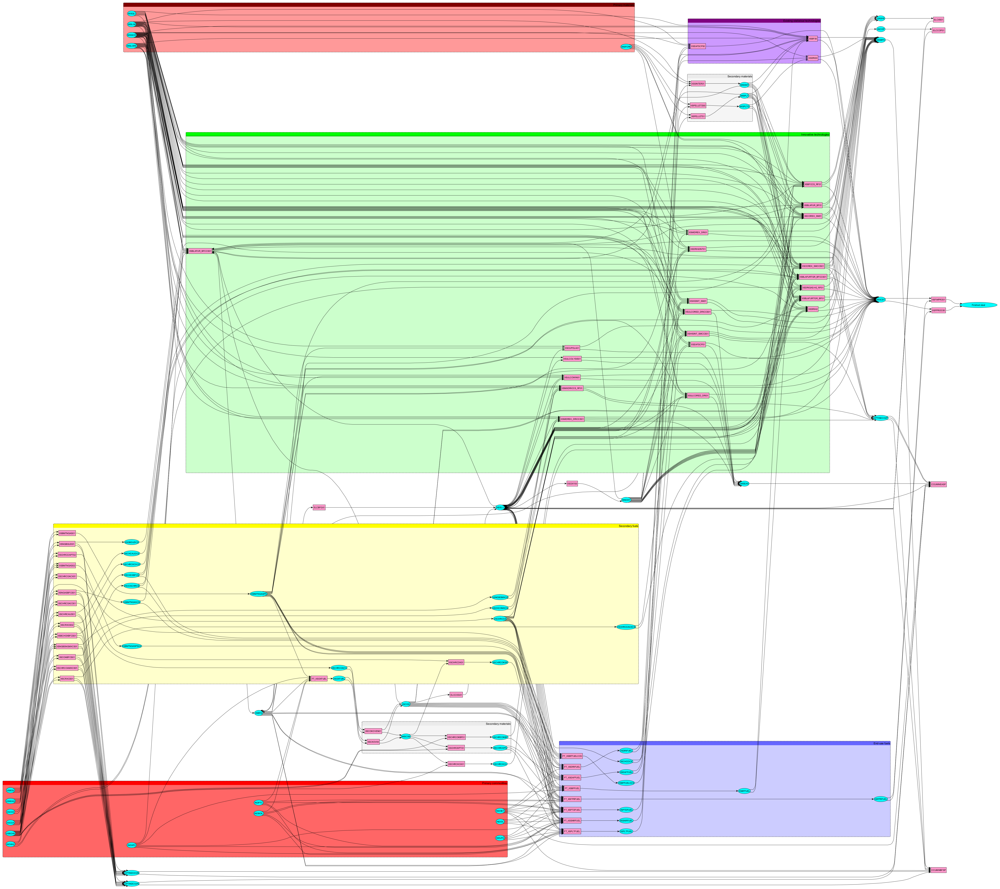

# Iron & Steel

The energy consumption of the iron and steel industry in 2018 is based on the IEA energy balance (IEA 2020). The process of the iron and steel industry consists of extracting iron ore and recycling steel scrap to produce cast iron which is turned into finished steel to be commercialized. The energy and materials required to transform iron ore into steel depends on the process involved. For example, BF-BOF processes require oxygen, limestone, coke, coal and other dense energies to bring the process to a high temperature. Electric arc furnaces (EAF) require oxygen, limestone, electricity and steel scrap. Figure 1 simplifies the flows between primary energy (fossil fuels, biogenic fuels, electricity, hydrogen, heat), secondary energy and fuel mixes, primary materials (limestone, iron ore, fine ore, quicklime), secondary materials (oxygen, sinter, pellets, coke), base-year technologies (BF-BOF, EAF, Direct Reduction of Iron (DRI)), innovative technologies (see dedicated section below), CO2 emissions, and [CO2 utilization](../../supply/synthetic-fuels.md) and [storage](../../../backstop/CO2-transport-and-storage.md) (CCUS), and finished products (cast iron and finished steel). The arrow from primary energy towards secondary energy represents the transofmration of hard coal into coke, pellets and sinter.

A more refined Reference Energy System (RES) of the iron and steel sector is available in Appendix 2.

In addition to conventional technologies presented in the previous section, TIAM-FR is featured with alternative technologies including electricity-based processes, carbon capture processes, direct reduction of iron, and other innovative technologies embodied in groups presented in Table 1 and listed in Appendix 1 along with their techno-economic properties.  
One important feature is that biomass use is available for both conventional and alternative steel production routes. Table 1 presents a summary of different substitution potentials between fossil fuels and bioenergy depending on the process. In general, charcoal can substitute only a small share of coke as it does not present the same physical and chemical characteristics. However, charcoal can substitute most of the coal (see the fifth column of Table 1), while biomethane is a perfect substitute for natural gas. Raw biomass cannot be used directly in any of these processes as it features high moisture content, volatile matter content, low calorific value, and low grindability, etc. (Mousa et al., 2016). Besides, biogas or syngas produced directly from anaerobic digestion and gasification cannot be used directly in the ISI as they do not present the same chemical composition as natural gas, and thus require purification and upgrading beforehand. The solver determines the optimal amount of bioproducts to substitute fossil fuels (any combination from 0% to 100% of biomass is the steel energy mix). Before 2030, charcoal is available only in Brazil, as around 11% of the country’s steel production uses charcoal instead of coal [25,26,66] and in Norway, which uses some charcoal in their steel mills. The use of bioproducts in the remaining regions is made possible starting from 2030. The harvesting potentials of the different bioproducts (wood, agriculture residues, organic waste, etc.) are taken from Kang et al. (2017).

Table 1: Possible uses for bioenergy in the steel industry. Substitution potentials are based on fuels' lower heating value.
| **Process**                                                       | **Availability date** | **Fossil fuel use** | **Bioproduct substitution** | **Maximum substitution potential based on LHV** | **Reference**                                    |
| ----------------------------------------------------------------- | --------------------- | ------------------- | --------------------------- | ----------------------------------------------- | ------------------------------------------------ |
| Coke oven                                                         | 2018                  | Coal                | Charcoal                    | 0%-5%                                           | (Mousa et al. 2016)                              |
| Pelletization                                                     | 2018                  | Coal                | Charcoal                    | 0%-100%                                         | (Nwachukwu, Wang et Wetterlund 2021)             |
| Sintering                                                         | 2018                  | Coke                | Charcoal                    | 0%-40%                                          |
| Blast Furnace / with CCS (including the Top Gas recycling option) | 2018 / 2025           | Coke                | Charcoal                    | 0%-6%                                           | (Suopajärvi et al. 2017)                         |
| Coal                                                              | Charcoal              | 0%-100%             |
| Natural gas                                                       | Biomethane            | 0%-100%             |
| Direct Reduction of Iron (MIDREX) / with CCS                      | 2018 / 2025           | Natural gas         | Biomethane                  | 0%-100%                                         | (Tanzer, Blok et Ramírez 2020)                   |
| COREX / with CCS                                                  | 2020 /2025            | Coal                | Charcoal                    | 0%-45%                                          | (Norgate et al. 2012)                            |
| Coke                                                              | Charcoal              | 0%-45%              |
| HIsarna / with CCS                                                | 2030                  | Coal                | Charcoal                    | 0%-45%                                          |
| ULCORED / with CCS                                                | 2030                  | Coal                | Charcoal                    | 0%-100%                                         | (Tanzer, Blok et Ramírez 2020)                   |
| Natural gas                                                       | Biomethane            | 0%-100%             |
| ULCOWIN                                                           | 2050                  | Natural gas         | Biomethane                  | 0%-100%                                         |
| Coal                                                              | Charcoal              | 0%-100%             |
| Cupola                                                            | 2018                  | Natural gas         | Biomethane                  | 0%-100%                                         |
| EAF                                                               | 2018                  | Coal                | Charcoal                    | 0%-100%                                         | (Yang, F., Meerman, J. C. et Faaij, A.P.C. 2021) |
| Natural gas                                                       | Biomethane            | 0%-100%             |
| DRI-H2 integrated steel plant                                     | 2030                  | Coal                | Charcoal                    | 0%-100%                                         | (Tanzer, Blok et Ramírez 2020)                   |
| Natural gas                                                       | Biomethane            | 0%-100%             |                             |
| Final production of steel                                         | 2018                  | Natural gas         | Biomethane                  | 0%-100%                                         |                                                  |

This modeling of steel was leveraged in a publication about the net-negatvive emissions potential of the sector (Andrade et al., 2024)

**Appendices**

**Appendix 1: techno-economic assumption of steel manufacturing processes in TIAM-FR**
|         |                 | Units        | Existing BF-BOF | Retrofitted BF-BOF w/CC | New BF-BOF | BF-BOF w/CC | BF-BOF w/TGR | BF-BOF w/CC & TGR | Existing coke oven | New coke oven | Corex | Corex w/CC | CUPOLA | Existing DRI | Retrofitted DRI-H2 | New DRI-H2 | DRI-H2 w/Electrolyzer | Existing EAF | NewEAF | Finishing process | New finishing process | Hisarna | Hisarna w/CC | Midrex | Midrex w/CC | Retrofitted Midrex w/CC | Existing oxygen production | New oxygen production | Existing pellet production | New pellet production | Existing sinter production | New sinter production | Ulcolysis | Ulcored | Ulcored w/CC | Ulcowin |
| ------- | --------------- | ------------ | --------------- | ----------------------- | ---------- | ----------- | ------------ | ----------------- | ------------------ | ------------- | ----- | ---------- | ------ | ------------ | ------------------ | ---------- | --------------------- | ------------ | ------ | ----------------- | --------------------- | ------- | ------------ | ------ | ----------- | ----------------------- | -------------------------- | --------------------- | -------------------------- | --------------------- | -------------------------- | --------------------- | --------- | ------- | ------------ | ------- |
|         | Availability    |              | 85%             | 85%                     | 85%        | 85%         | 85%          | 85%               | 95%                | 95%           | 85%   | 85%        | 90%    | 85%          | 85%                | 85%        | 85%                   | 85%          | 90%    | 90%               | 90%                   | 85%     | 85%          | 85%    | 85%         | 85%                     | 85%                        | 85%                   | 95%                        | 95%                   | 95%                        | 95%                   | 85%       | 85%     | 85%          | 85%     |
|         | Lifetime        | y            | 25              | 25                      | 25         | 20          | 25           | 20                |                    | 25            | 30    | 25         | 30     | 25           | 25                 | 40         | 40                    | 25           | 25     | 20                | 20                    | 25      | 20           | 25     | 20          | 25                      | 20                         | 30                    |                            | 25                    |                            | 25                    | 25        | 25      | 20           | 25      |
|         | Investment cost | [$2018/Mtpa] |                 | 426                     | 335        | 412         | 632          | 692               |                    | 9             | 414   | 507        | 1126   |              | 437                | 587        | 989                   |              | 240    |                   | 195                   | 918     | 961          | 510    | 531         | 462                     |                            | 353                   |                            | 126                   |                            | 71                    | 775       | 593     | 658          | 731     |
|         | Fixed costs     | [$2018/Mtpa] | 19              | 80                      | 58         | 64          | 70           | 77                |                    |               | 54    | 51         | 113    | 16           | 59                 | 59         | 69                    | 13           | 25     | 56                | 56                    | 103     | 151          | 32     | 37          | 34                      | 18                         | 18                    | 3                          | 6                     | 3                          | 3                     | 51        | 58      | 62           | 76      |
|         | Variable costs  | [$2018/Mt]   | 59              | 64                      | 19         | 23          | 19           | 23                | 2                  | 2             | 18    | 23         | 225    | 51           | 41                 | 40         | 42                    | 59           | 36     | 11                | 11                    | 56      | 67           | 40     | 44          | 56                      |                            |                       | 5                          | 5                     | 6                          | 6                     |           | 38      | 42           | 36      |
|         | Start year      |              |                 | 2030                    | 2020       | 2020        | 2030         | 2030              |                    | 2020          | 2025  | 2025       | 2020   |              | 2030               | 2030       | 2030                  |              | 2020   |                   | 2020                  | 2030    | 2030         | 2020   | 2030        | 2030                    |                            | 2020                  |                            | 2020                  |                            | 2020                  | 2050      | 2030    | 2030         | 2050    |
| Inputs  | Coke or biochar | [PJ]         | 13.43           | 15.9                    | 15.17      | 10.44       | 7.7          | 7.7               | 0.07               | 0.02          | 24.3  | 24.3       |        |              |                    |            |                       |              |        |                   |                       | 13.41   | 13.41        |        |             |                         |                            |                       | 3.92                       | 2.15                  | 2.67                       | 0.89                  |           |         |              |         |
|         | Coal or biochar | [PJ]         | 3.37            | 6.53                    | 6.53       | 1.35        | 1.46         | 3.02              | 3.02               |               |       |            |        |              |                    |            |                       |              |        |                   |                       |         |              |        |             |                         |                            |                       |                            |                       |                            |                       |           |
|         | Gas or biogas   | [PJ]         |                 |                         |            | 0.51        | 0.25         |                   | 0.16               | 0.14          |       |            | 11.4   | 13.85        | 0.77               | 0.77       | 1.41                  |              |        |                   |                       |         |              | 16.17  | 12.79       | 12.79                   |                            |                       |                            |                       |                            |                       |           | 10.91   | 11.41        |         |
|         | Hydrogen        | [PJ]         |                 |                         |            |             |              |                   |                    |               |       |            |        |              | 6.41               | 6.41       |                       |              |        |                   |                       |         |              |        |             |                         |                            |                       |                            |                       |                            |                       |           |         |              |         |
|         | Electricity     | [PJ]         |                 |                         |            | 0.97        | 0.15         | 0.88              |                    |               | 0.39  | 1.02       | 4.6    |              | 2.32               | 1.66       | 12.35                 | 2.29         | 3.17   | 2.36              |                       |         |              |        |             |                         | 1.03                       | 0.72                  |                            |                       |                            |                       | 14.2      | 3.16    | 3.57         | 11.24   |
|         | Heavy fuel oil  | [PJ]         |                 |                         |            | 0.64        | 0            |                   |                    |               |       |            |        |              |                    |            |                       |              |        |                   |                       |         |              |        |             |                         |                            |                       |                            |                       |                            |                       |           |         |              |         |
|         | Limestone       | [Mt]         | 0.02            | 0.02                    | 0.02       | 0.02        | 0.02         | 0.02              |                    |               | 0.28  | 0.28       |        |              | 0.07               | 0.07       | 0.07                  | 0.07         | 0.07   |                   |                       |         |              | 0.14   | 0.14        | 0.14                    |                            |                       |                            |                       |                            |                       | 0.05      | 0.17    | 0.17         | 0.18    |
|         | Lump ore        | [Mt]         | 0.37            | 0.37                    | 0.37       | 0.37        |              |                   |                    |               | 0.54  | 0.54       |        |              |                    |            |                       |              |        |                   |                       | 1.42    | 1.42         | 1.27   | 1.27        | 1.27                    |                            |                       |                            |                       |                            |                       | 1.51      | 1.27    | 1.27         | 1.51    |
|         | Fine ore        | [Mt]         | 0               | 0                       | 0          | 0           | 0            | 0                 | 0                  | 0             | 0.14  | 0.15       | 0      | 0            | 0                  | 0          | 1.51                  |              |        |                   |                       |         |              |        |             |                         |                            |                       | 1                          | 1                     | 1.16                       | 1.15                  |           |         |              |         |
|         | Oxygen          | [Mt]         | 0.07            | 0.07                    | 0.05       | 0.05        | 0.17         | 0.17              |                    |               | 0.41  | 0.41       |        |              |                    | 0.03       | 0                     | 0.05         | 0.05   |                   |                       | 1.09    | 1.09         |        |             |                         |                            |                       |                            |                       |                            |                       |           | 0.11    | 0.11         |         |
|         | Pellets         | [Mt]         | 0.09            | 0.09                    | 0.09       | 0.09        | 0.72         | 0.72              |                    |               | 0.68  | 0.68       |        |              |                    |            |                       |              |        |                   |                       |         |              |        |             |                         |                            |                       |                            |                       |                            |                       |           |         |              |         |
|         | Quick lime      | [Mt]         | 0.05            | 0.05                    | 0.05       | 0.05        |              |                   |                    |               | 0.05  | 0.05       |        |              |                    |            |                       |              |        |                   |                       | 0.03    | 0.03         |        |             |                         |                            |                       |                            |                       |                            |                       |           |         |              |         |
|         | Scrap           | [Mt]         | 0.18            | 0.18                    | 0.18       | 0.18        | 0.17         | 0.17              |                    |               | 0.18  | 0.18       | 1.3    | 0.16         | 0.12               | 0.12       | 0.12                  | 1.23         | 1.23   |                   |                       | 0.17    | 0.17         | 0.16   | 0.16        | 0.16                    |                            |                       |                            |                       |                            |                       |           | 0.16    | 0.16         |         |
|         | Sinter          | [Mt]         | 1.09            | 1.09                    | 1.09       | 1.09        | 0.7          | 0.7               |                    |               |       |            |        |              |                    |            |                       |              |        |                   |                       |         |              |        |             |                         |                            |                       |                            |                       |                            |                       |           |         |              |         |
|         | Crude steel     | [Mt]         |                 |                         |            |             |              |                   |                    |               |       |            |        |              |                    |            |                       |              |        | 1                 | 1                     |         |              |        |             |                         |                            |                       |                            |                       |                            |                       |           |         |              |         |
| Outputs | Crude steel     | [Mt]         | 1               | 1                       | 1          | 1           | 1            | 1                 |                    |               | 1     | 1          | 1      | 1            | 1                  | 1          | 1                     | 1            | 1      |                   |                       | 1       | 1            | 1      | 1           | 1                       |                            |                       |                            |                       |                            |                       | 1         | 1       | 1            | 1       |
|         | Gases           | [PJ]         | 5.09            | 4.11                    | 4.11       | 4.11        | 0.25         | 0.25              | 0.16               | 0.14          | 11.55 | 0.65       |        |              |                    |            |                       |              |        |                   |                       |         |              |        |             |                         |                            |                       |                            |                       |                            |                       |           |         |              |         |
|         | Slags           | [Mt]         | 0.35            | 0.35                    | 0.35       | 0.35        | 0.34         | 0.34              |                    |               | 0.44  | 0.44       |        | 0.17         | 0.21               | 0.21       | 0.21                  | 0.26         | 0.17   |                   |                       |         | 0.26         | 0.17   | 0.17        | 0.17                    |                            |                       |                            |                       |                            |                       |           |         |              |         |
|         | Process CO2     | [kt]         | 44              | 44                      | 32         | 3           | 11           | 1                 |                    |               | 144   | 14         |        |              | 31                 | 31         | 31                    | 44           | 44     |                   |                       | 14      | 1            | 62     | 6           | 6.16                    |                            |                       |                            |                       |                            |                       |           |         |              |         |
|         | Finished steel  | [Mt]         |                 |                         |            |             |              |                   |                    |               |       |            |        |              |                    |            |                       |              |        | 1                 | 1                     |         |              |        |             |                         |                            |                       |                            |                       |                            |                       |           |         |              |         |
|         | Oxygen          | [Mt]         |                 |                         |            |             |              |                   |                    |               |       |            |        |              |                    |            |                       |              |        |                   |                       |         |              |        |             |                         | 1                          | 1                     |                            |                       |                            |                       |           |         |              |         |
|         | Pellets         | [Mt]         |                 |                         |            |             |              |                   |                    |               |       |            |        |              |                    |            |                       |              |        |                   |                       |         |              |        |             |                         |                            |                       | 1                          | 1                     |                            |                       |           |         |              |         |
|         | Coke            | [PJ]         |                 |                         |            |             |              |                   | 1                  | 1             |       |            |        |              |                    |            |                       |              |        |                   |                       |         |              |        |             |                         |                            |                       |                            |                       |                            |                       |           |         |              |         |
|         | Sinter          | [Mt]         |                 |                         |            |             |              |                   |                    |               |       |            |        |              |                    |            |                       |              |        |                   |                       |         |              |        |             |                         |                            |                       |                            |                       | 1                          | 1                     |           |         |              |         |

**Appendix 2: extended Reference Energy System (RES) of the iron and steel industry in TIAM-FR**

**References**

Kang, S., 2017. La place de la bioénergie dans un monde sobre en carbone: Analyse prospective et développement de la filière biomasse dans le modèle TIAM-FR. MINES ParisTech.  
Mousa E, Wang C, Riesbeck J et al. (2016) Biomass applications in iron and steel industry: An overview of challenges and opportunities. Renewable and Sustainable Energy Reviews 65:1247–1266. https://doi.org/10.1016/j.rser.2016.07.061  
Nwachukwu, C.M., Wang, C., Wetterlund, E., 2021. Exploring the role of forest biomass in abating fossil CO2 emissions in the iron and steel industry – The case of Sweden. Applied Energy 288.
Suopajärvi, H., Kemppainen, A., Haapakangas, J., Fabritius, T., 2017. Extensive review of the opportunities to use biomass-based fuels in iron and steelmaking processes. Journal of Cleaner Production 148, 709–734. https://doi.org/10.1016/j.jclepro.2017.02.029  
Tanzer, S.E., Blok, K., Ramírez, A., 2021. Decarbonising Industry via BECCS: Promising Sectors, Challenges, and Techno-economic Limits of Negative Emissions. Curr Sustainable Renewable Energy Rep 8, 253–262. https://doi.org/10.1007/s40518-021-00195-3  
Norgate, T., Haque, N., Somerville, M., Jahanshahi, S., 2012. Biomass as a Source of Renewable Carbon for Iron and Steelmaking. ISIJ International 52, 1472–1481. https://doi.org/10.2355/isijinternational.52.1472  
Yang, F., Meerman, J.C., Faaij, A.P.C., 2021. Carbon capture and biomass in industry: A techno-economic analysis and comparison of negative emission options. Renewable and Sustainable Energy Reviews 144, 111028. https://doi.org/10.1016/j.rser.2021.111028  
Andrade, C., Desport, L., Selosse, S., 2024. Net-negative emission opportunities for the iron and steel industry on a global scale. Applied Energy 358, 122566. https://doi.org/10.1016/j.apenergy.2023.122566

