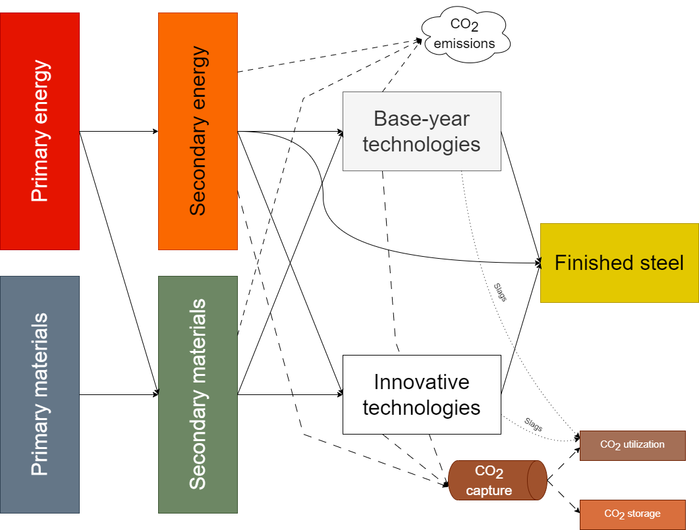

# Iron & Steel

The energy consumption of the iron and steel industry in 2018 is based on the IEA energy balance (IEA 2020). The process of the iron and steel industry consists of extracting iron ore and recycling steel scrap to produce cast iron which is turned into finished steel to be commercialized. The energy and materials required to transform iron ore into steel depends on the process involved. For example, BF-BOF processes require oxygen, limestone, coke, coal and other dense energies to bring the process to a high temperature. Electric arc furnaces (EAF) require oxygen, limestone, electricity and steel scrap. Figure 1 simplifies the flows between primary energy (fossil fuels, biogenic fuels, electricity, hydrogen, heat), secondary energy and fuel mixes, primary materials (limestone, iron ore, fine ore, quicklime), secondary materials (oxygen, sinter, pellets), base-year technologies (BF-BOF, EAF, Direct Reduction of Iron (DRI)), innovative technologies (see Section [Innovative technologies](Innovative technologies), CO2 emissions, CO2 capture utilization and storage (CCUS), and finished products.

## Innovative technologies

In addition to conventional technologies presented in the previous section, TIAM-FR is features with alternative  technologies including electricity-based processes, carbon capture processes, direct reduction of iron, and other innovative technologies embodied in groups featured in Figure 1.

## Biomass use

One important novelty of this work is that we have included new opportunities to use biomass for both conventional and alternative steel production routes. Table 1 presents a summary of the different potentials (found in the literature) to substitute fossil fuels with bioproducts for the different iron and steel technologies. In general, charcoal can substitute only a small share of the use of coke as it does not present the same physical and chemical characteristics. On the other hand, charcoal can substitute most of the coal (see the fifth column of Table 1), while biomethane is a perfect substitute for natural gas. Raw biomass cannot be used directly in any of these processes as it features high moisture content, volatile matter content, low calorific value, and low grindability, etc. [20]. Besides, biogas or syngas produced directly from anaerobic digestion and gasification cannot be used directly in the ISI as they do not present the same chemical composition as natural gas, and thus require purification and upgrading beforehand. The solver chooses the optimal amount of bioproducts to substitute fossil fuels (any combination from 0% to 100% of biomass is the steel energy mix). Before 2030, charcoal is available only in Brazil, as around 11% of the country’s steel production uses charcoal instead of coal [25,26,66] and in Norway, which uses some charcoal in the steel industry. The use of bioproducts in the remaining regions is made possible starting from 2030. The harvesting potentials of the different bioproducts (wood, agriculture residues, organic waste, etc.) are taken from [67]. Fig. 4 represents the maximum emissions reduction achievable, by substituting fossil fuels with biomass. Thus, the lowest emissions levels can be obtained with the HIsarna and MIDREX CCS processes. Without biomass and CCS, the COREX process is the most polluting route as it has high energy requirements, which are mostly covered by coal. This route produces 2.9 kt CO2/t steel. Finally, the emission intensities for each of the commodities used in the model are based on the values from [68] (Table 2).

| **Process**                                                       | **Availability date** | **Fossil fuel use** | **Bioproduct substitution** | **Maximum substitution potential based on LHV** | **Reference**                                    |
| ----------------------------------------------------------------- | --------------------- | ------------------- | --------------------------- | ----------------------------------------------- | ------------------------------------------------ |
| Coke oven                                                         | 2018                  | Coal                | Charcoal                    | 0%-5%                                           | (Mousa et al. 2016)                              |
| Pelletization                                                     | 2018                  | Coal                | Charcoal                    | 0%-100%                                         | (Nwachukwu, Wang et Wetterlund 2021)             |
| Sintering                                                         | 2018                  | Coke                | Charcoal                    | 0%-40%                                          |
| Blast Furnace / with CCS (including the Top Gas recycling option) | 2018 / 2025           | Coke                | Charcoal                    | 0%-6%                                           | (Suopajärvi et al. 2017)                         |
| Coal                                                              | Charcoal              | 0%-100%             |
| Natural gas                                                       | Biomethane            | 0%-100%             |
| Direct Reduction of Iron (MIDREX) / with CCS                      | 2018 / 2025           | Natural gas         | Biomethane                  | 0%-100%                                         | (Tanzer, Blok et Ramírez 2020)                   |
| COREX / with CCS                                                  | 2020 /2025            | Coal                | Charcoal                    | 0%-45%                                          | (Norgate et al. 2012)                            |
| Coke                                                              | Charcoal              | 0%-45%              |
| HIsarna / with CCS                                                | 2030                  | Coal                | Charcoal                    | 0%-45%                                          |
| ULCORED / with CCS                                                | 2030                  | Coal                | Charcoal                    | 0%-100%                                         | (Tanzer, Blok et Ramírez 2020)                   |
| Natural gas                                                       | Biomethane            | 0%-100%             |
| ULCOWIN                                                           | 2050                  | Natural gas         | Biomethane                  | 0%-100%                                         |
| Coal                                                              | Charcoal              | 0%-100%             |
| Cupola                                                            | 2018                  | Natural gas         | Biomethane                  | 0%-100%                                         |
| EAF                                                               | 2018                  | Coal                | Charcoal                    | 0%-100%                                         | (Yang, F., Meerman, J. C. et Faaij, A.P.C. 2021) |
| Natural gas                                                       | Biomethane            | 0%-100%             |
| DRI-H2 integrated steel plant                                     | 2030                  | Coal                | Charcoal                    | 0%-100%                                         | (Tanzer, Blok et Ramírez 2020)                   |
| Natural gas                                                       | Biomethane            | 0%-100%             |                             |
| Final production of steel                                         | 2018                  | Natural gas         | Biomethane                  | 0%-100%                                         |                                                  |

## References
