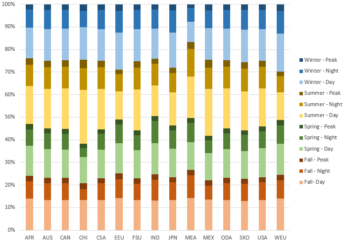
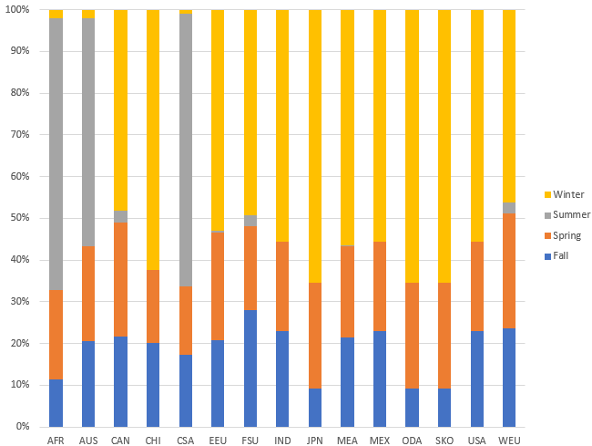

# Residential

The residential sector encompasses seven [energy demands](demands/index.md) including space heating (RSH), space cooling (RSC), cooking (RCK), water heating (CHW), lighting (RLI), clothes drying (RCD), clothes washing (RCW), dishwashing (RDW), refrigeraton (RRF) and other electrical demands (ROE) other non-electrical demands (ROT). For each demand, the energy consumption in the base year is calibrated based on IEA energy balances (2020).The technologies and energies available in future years to satisfy energy demands are described in the following subsections.
The demand for commercial energy services varies according to the period of the year (Figure 1) and space heating behaves slightly differently from the rest of residential energy demands (Figure 2).

Figure 1: Seasonal, time-slice residential energy demands in TIAM-FR across regions

Figure 2: Seasonal, time-slice space heating energy demand in TIAM-FR across regions

Residential energy demands can be satisfied by multiple technologies including heat pumps, and processed with numerous energies including gas, coal, electricity, bioenergy, and oil products.

## Technologies and energy carriers

For space heating, end-use technologies include district heating, electrical resistance, air-to-air heat pumps, ground-to-air heat pumps, concentrated solar, geothermal pumps, woodstoves, as well as burner and boilers either fueled by distillates, LPG, kerosene, heavy fuel oil, fossil gas or coal.  
For hot water, electricity can be employed into water heater resistance or air-to-water heat pumps. Solar energy can be employed in water heater and potentially backed up with electricity, oil, LPG or gas.  Conventional fuels like woody products, kerosene, and coal can be used raw to fuel water heaters. Finally, geothermal enegry and distributed heat can provide low-carbon hot water.  
Clothes can be dried mainly from electricity icluding innovative ultra-sound or reduced-water driers. More traditional driers run in tandem with fossil gas and electricity. Likewise, several dish washers with efficiencies from 100\% to 200\% are available.  
Cooking devices are distinguished by the fuels employed (gas, kerosone, diesel, coal, LPG, electricity, biomass, or solar) with efficiencies ranging from 100\% to 200\%.  
Lighting is satisfied by technologies including incandescent, fluorescent, halogen, and compact light devices with efficiencies ranging from 100\% to 700\%. Conventional devices include kerosene lighting.  
Finally, the cooling demand can be satisfied by air-to-air and ground-to-air heat pumps, with coefficients of performance up to 4.4.

## References

IEA, 2020. World Energy Balances – Analysis [WWW Document]. IEA. URL https://www.iea.org/reports/world-energy-balances-overview (accessed 3.14.22).
