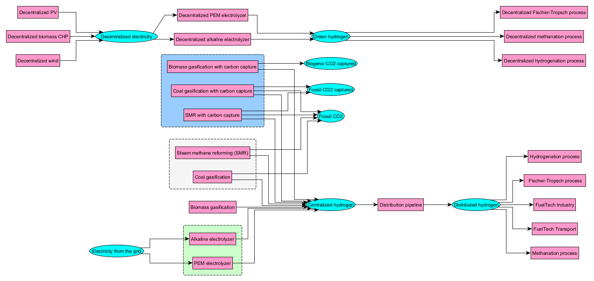

# Hydrogen

The hydrogen production sector encompasses the three main routes known as the grey, blue, and green routes. The reference energy system for hydrogen generation is shown in Figure 1. H2 can be generated from diverse energy carriers, i.e. decentralized or centralized electricty, biomass, fossil gas, or coal.  
For decentralized electricity - which cen be generated by stand-alone photovolaics, wind turbines or biomass CHP, it is processed by either PEM of alkaline electrolyzers disconnected from the grid to supply stand-alone [CO2 refineries](synthetic-fuels.md) for producing Fischer-Tropsch fuels, synthetic methane, or synthetic methanol. In that case, the production of green hydrogen is subject to the variability of the decentralized power sources.
A similar route can be achieved with the [electricity from the grid](power-sector.md) at the expense of distributing hydrogen through a pipeline network but supplying hydrogen 90% of the time of a year. 
Other Centralized processes include the grey routes i.e. thought steam methane reforming (SMR) and coal gasification, generating massive amounts of fossil carbon dioxide (CO2). Besides, biomass gasification becomes available as of 2030. As the same time horizon, the three latter process can be equipped with carbon capture units avoiding for 90% of the emissions of grey routes. This CO2 can either be [stored or utilized](CO2-accounting.md) and depending on the nature of the carbon (biogenic or fossil), could yield negative emissions. In the framework of a centralized network, H2 needs to be distributed through pipelines before being consumed by centralized CO2 refineries or distributed to the industry and transport sectors.

In terms of techno-economics, the model is featured with a user-defined assumption on the cost of hydrogen generation referenced by the Low, Central and High estimations of Parkinson et al. (2019) for the grey and blue routes (Table 1). For these routes, future costs are estimated with the assumptions of (IEA, 2015). Regarding the green route, base-year costs are extracted from the 2020 DNV-GL report and future costs were estimated based on the expert elicitation produced by Schmidt et al. (2020). The costs shown below in Table 2 refer to the Central assumption of Parkinson et al. (2019) and the average results of Schmidt et al. (2020).

Table 1: Estimation of the levelized cost of hydrogen under different assumptions extracted from (Parkison et al., 2019)
|    Technology | Low  | Medium | High |
| ------------- | ---- | ------ | ---- |
| SMR           | 1.03 | 1.26   | 2.16 |
| SMR w/CCS     | 1.93 | 2.09   | 2.26 |
| Coal          | 0.96 | 1.38   | 1.88 |
| Coal w/CCS    | 2.24 | 2.46   | 2.68 |
| Biomass       | 1.48 | 2.24   | 3.00 |
| Biomass w/CCS | 3.15 | 3.37   | 3.60 |

Table 2: Techno-economic assumptions for different hydrogen production routes
| Process                                    | Attribute  | Units | 2018   | 2030   | 2040 | 2050 |
| ------------------------------------------ | ---------- | ----- | ------ | ------ | ---- | ---- |
| Alkaline electrolyzer                      | Efficiency |       | 64%    | 68%    | 69%  | 71%  |
|                                            | CAPEX      | $/kW  | 1802   | 1213   | 1213 | 1213 |
|                                            | FIXOM      | $/kW  | 21     | 17     | 15   | 13   |
|                                            | Lifespan   | years | 14     | 14     | 14   | 14   |
| Biomass gasification                       | OPEX       | $/GJ  | 0.85   |        |      |      |
|                                            | Efficiency |       | 55%    |        |      |      |
|                                            | CAPEX      | $/kW  | 1695   | 1356   |      |      |
|                                            | FIXOM      | $/kW  | 69     | 33     |      |      |
|                                            | Lifespan   | years | 20     |        |      |      |
| Coal gasification                          | OPEX       | $/GJ  | 0.15   |        |      |      |
|                                            | Efficiency |       | 60%    |        |      |      |
|                                            | CAPEX      | $/kW  | 1341   | 1073   |      |      |
|                                            | FIXOM      | $/kW  | 55     | 26     |      |      |
|                                            | Lifespan   | years | 25     |        |      |      |
| Steam methane reformer                     | OPEX       | $/GJ  | 0.07   |        |      |      |
|                                            | Efficiency |       | 76%    |        |      |      |
|                                            | CAPEX      | $/kW  | 871.09 | 696.88 |      |      |
|                                            | FIXOM      | $/kW  | 21.38  | 17.11  |      |      |
|                                            | Lifespan   | years | 25.00  |        |      |      |
| PEM electrolyzer                           | Efficiency |       | 61%    | 67%    | 69%  | 71%  |
|                                            | CAPEX      | $/kW  | 2654   | 1980   | 1980 | 1980 |
|                                            | FIXOM      | $/kW  | 37     | 19     | 14   | 11   |
|                                            | Lifespan   | years | 13     | 14     | 14   | 14   |
| Biomass gasification with carbon capture   | OPEX       | $/GJ  | 0.85   |        |      |      |
|                                            | Efficiency |       | 44%    |        |      |      |
|                                            | CAPEX      | $/kW  | 2751   | 2109   |      | 2010 |
|                                            | FIXOM      | $/kW  | 113    | 86     |      | 82   |
|                                            | Lifespan   | years | 20     |        |      |      |
| Coal gasification with carbon capture      | OPEX       | $/GJ  | 0.20   |        |      |      |
|                                            | Efficiency |       | 58%    |        |      |      |
|                                            | CAPEX      | $/kW  | 2418   | 1853   |      | 1766 |
|                                            | FIXOM      | $/kW  | 99     | 76     |      | 72   |
|                                            | Lifespan   | years | 20     |        |      |      |
| Steam methane reformer with carbon capture | OPEX       | $/GJ  | 0.49   |        |      |      |
|                                            | Efficiency |       | 69%    |        |      |      |
|                                            | CAPEX      | $/kW  | 1866   | 954    |      | 913  |
|                                            | FIXOM      | $/kW  | 46     | 23     |      | 23   |
|                                            | Lifespan   | years | 20     |        |      |      |

## References

Parkinson, B., Balcombe, P., Speirs, J.F., Hawkes, A.D., Hellgardt, K., 2019. Levelized cost of CO2 mitigation from hydrogen production routes. Energy Environ. Sci. 12, 19–40. https://doi.org/10.1039/C8EE02079E
IEA, 2015. Technology Roadmap Hydrogen and Fuel Cells 81.
DNV-GL, 2020. Study on the Import of Liquid Renewable Energy: Technology Cost Assessment 32.
Schmidt, O., Gambhir, A., Staffell, I., Hawkes, A., Nelson, J., Few, S., 2017. Future cost and performance of water electrolysis: An expert elicitation study. International Journal of Hydrogen Energy 42, 30470–30492. https://doi.org/10.1016/j.ijhydene.2017.10.045
