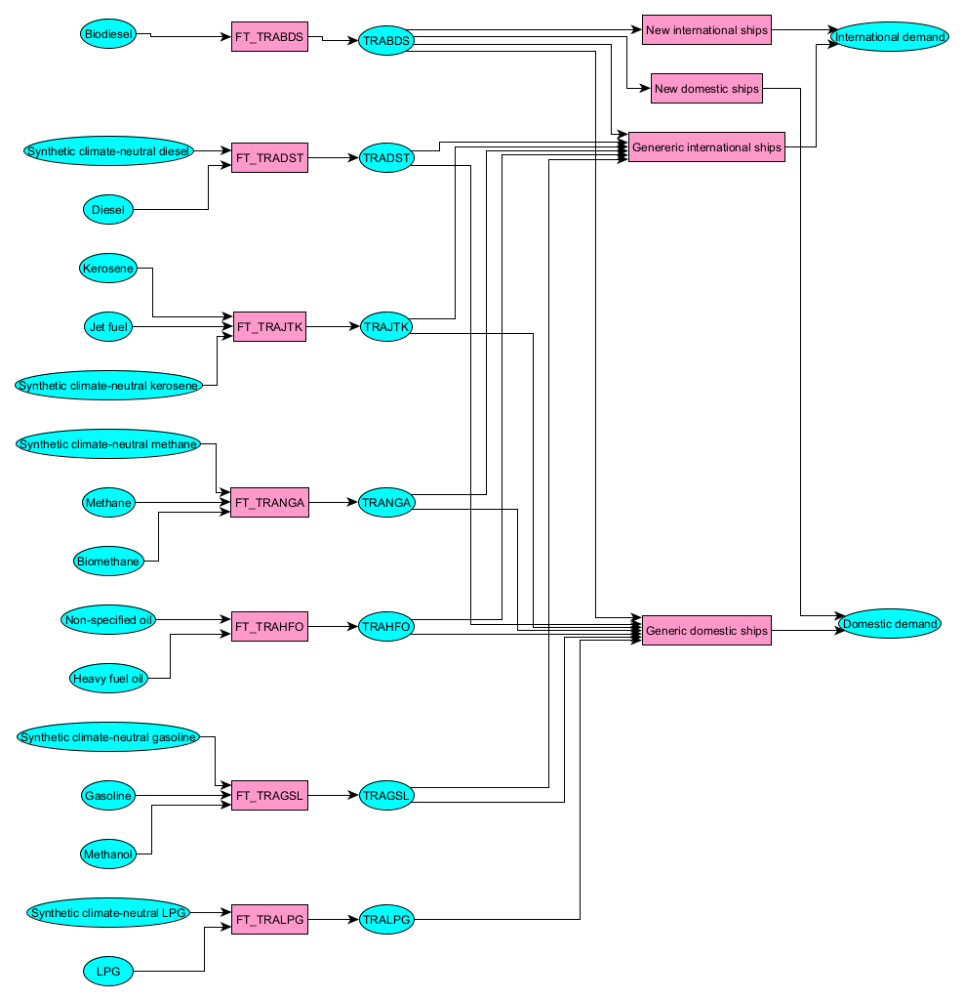

# Transport

The transport sector can be categorized based on energy demands into four segments: road, rail, water, and air. Each segment is divided into specific energy demands whose value are [extrapolated based on Shared Socio-economic Pathways (SSP)](../demands/index.md) (Riahi, 2017). These demands are satisfied by various fuels combined and assembled through so-called *FuelTechs* designed to represent realistic energy supply for each category. The intial shares for supply energy demands are extracted from based on (IEA, 2020). The following subsections detials the topology and assumptions for satisfying and decarbonizing transport energy demands.

## Aviation

As shown in Figure 1, the international and domestic energy demands for aviation include heavy fuel oil, diesel and jet fuels, gasoline, but according to (IEA, 2020) jet fuel make almost 100% energy input shares. Both can be decarbonized by synthetic fuels but biofuels are not considered.

## Navigation

As shown in Figure 2, the international and domestic energy demands for maritime transport include heavy fuel oil, diesel, kerosene, gasoline. Both can be decarbonized by synthetic fuels and biodiesel in modern fleet.

## Road

The demand for transport road is split into different vehicle-based categories whose fuel and technologies differ whether it cars, trucks or 2-wheel vehicles.

### Fuels

In terms of fuels, the demand for road transport can be satisfied with the fuels displayed in Figure 3. 

Methanol blending

### Technologies

Existing technologies for buses are or powered by conventional fuels as Table 1 shows.. Innovative technologies more efficient engines for the fuels already available in the base year, as well as engines that can be fueled with low-carbon fuels.

| Demand sector | Existing technologies | Innovative technologies |
| ------------- | --------------------- | ----------------------- |
| Road bus      | Biodiesel, diesel, biogasoline, gasoline, electricity, fossil gas, biogas, LPG | Ethanol, methanol, diesel, hydrogen fuel cells |
| Commercial trucks | Biodiesel, diesel, biogasoline, gasoline, electricity, fossil gas, biogas, LPG | Ethanol, methanol, diesel, hydrogen fuel cells |
| Heavy trucks | Biodiesel, biogasoline, diesel, gasoline, fossil gas, LPG | Diesel, gasoline, ethanol, methanol, gas, LPG, hydrogen fuel cells |
| Road medium trucks | Biodiesel, Biogasoline, diesel, gasoline, electricity, LPG, gas | Diesel, gasoline electricity, ethanol, LPG, gas |
| Road cars | Biodiesel, Biogasoline, diesel, gasoline, electricity, LPG, gas | Diesel, gasoline, ethanol, methanol, gas, hydrogen fuel cells, hydrogen combustion |
| Road light vehicle | Biodiesel, Biogasoline, diesel, gasoline, electricity, LPG, gas | Diesel, gasoline, ethanol, methanol, gas, hydrogen fuel cells, hydrogen combustion |
| Three wheels | Diesel, gasoline | Biodiesel, Biogasoline, methanol, diesel, gasoline |
| Two wheels | Biogasoline, gasoline | Biogasoline, gasoline |

## Rail

**References**  
Riahi, K., van Vuuren, D.P., Kriegler, E., Edmonds, J., O’Neill, B.C., Fujimori, S., Bauer, N., Calvin, K., Dellink, R., Fricko, O., Lutz, W., Popp, A., Cuaresma, J.C., Kc, S., Leimbach, M., Jiang, L., Kram, T., Rao, S., Emmerling, J., Ebi, K., Hasegawa, T., Havlik, P., Humpenöder, F., Da Silva, L.A., Smith, S., Stehfest, E., Bosetti, V., Eom, J., Gernaat, D., Masui, T., Rogelj, J., Strefler, J., Drouet, L., Krey, V., Luderer, G., Harmsen, M., Takahashi, K., Baumstark, L., Doelman, J.C., Kainuma, M., Klimont, Z., Marangoni, G., Lotze-Campen, H., Obersteiner, M., Tabeau, A., Tavoni, M., 2017. The Shared Socioeconomic Pathways and their energy, land use, and greenhouse gas emissions implications: An overview. Global Environmental Change 42, 153–168. https://doi.org/10.1016/j.gloenvcha.2016.05.009
