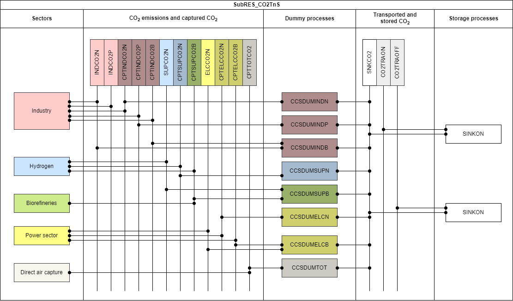

# CO2 transport and storage

The regional CO2 storage potential assumed in TIAM-FR are as Table 1 shows. They correspond to the lower estimate of Kearns et al. (2017).

Table 1: Assumed regional CO2 storage potentials in TIAM-FR (Kearns et al., 2017)
|              |Onshore|Offshore|
|--------------|-------|--------|
|AFR           |   1543|    9444|
|AUS           |   1835|    2349|
|CAN           |    790|    1445|
|CHI           |    544|    2286|
|CSA           |   1660|    4683|
|EEU           |    495|     565|
|FSU           |    876|   11207|
|IND           |    172|     525|
|JPN           |     34|      26|
|MEA           |    851|    2603|
|MEX           |    411|     556|
|ODA           |   1831|    2058|
|SKO           |     24|       0|
|USA           |   1836|    3872|
|WEU           |    495|     565|

CO2 capture opportunities are available in TIAM-FR in the [industry sector](energy-sectors/industry/index.md), [hydrogen generation](energy-sectors/supply/hydrogen.md), [biofuels generation](energy-sectors/supply/biofuels.md), [power generation](energy-sectors/supply/power-sector.md), and for [direct air capture](/backstop/dac/index.md), thus delivering three types of CO2 commodity: fossil, process, biogenic or atmospheric. Both biogenic and atmospheric CO2 are classified as climate-neutral CO2. In Figure 1, these commodities are respectively colored in orange, grey, and green. Dummy processes - labeled generically with CCSDUM prefix - aggregate all captured CO2 types into a single commodity labeled SNKCO2, as described in the [CO2 accounting](CO2-accounting.md) section, such that any SNKCO2 generated by the dummy processes is eliminated in a storage process, either onshore  (SINKON) or offshore (SINKOFF). Regarding the transport of CO2, there is actually no process to represent it physically. However, to eliminate the CO2 (SNKCO2), the system must pay for the transport and storage, whose cost are shown in Table 2 and assumed from Smith et al. (2021).    

To realistically model the operations of CO2 storage, a constraint on the CO2 injection rate limits the annual activity of CO2 storage processes. This rate of 2.6% (Jahediesfanjani et al., 2018) is consistent with the average injection rates of a well over its economic lifetime
Finally, we consider that the exchange of captured CO2 between countries is allowed by international regulations under the London Protocol (IEAGHG, 2021). As some of the regions in the model are country-aggregated (e.g., WEU, AFR, CSA, etc.), it is important to assume that countries can store CO2 in a different country from where it was emitted and captured.

## References

Kearns, J., Teletzke, G., Palmer, J., Thomann, H., Kheshgi, H., Chen, Y.-H.H., Paltsev, S., Herzog, H., 2017. Developing a Consistent Database for Regional Geologic CO2 Storage Capacity Worldwide. Energy Procedia, 13th International Conference on Greenhouse Gas Control Technologies, GHGT-13, 14-18 November 2016, Lausanne, Switzerland 114, 4697–4709. https://doi.org/10.1016/j.egypro.2017.03.1603  
Smith, E., Morris, J., Kheshgi, H., Teletzke, G., Herzog, H., Paltsev, S., 2021. The cost of CO2 transport and storage in global integrated assessment modeling. International Journal of Greenhouse Gas Control 109, 103367. https://doi.org/10.1016/j.ijggc.2021.103367  
Jahediesfanjani, H., Warwick, P.D., Anderson, S.T., 2018. Estimating the pressure-limited CO2 injection and storage capacity of the United States saline formations: Effect of the presence of hydrocarbon reservoirs. International Journal of Greenhouse Gas Control 79, 14–24. https://doi.org/10.1016/j.ijggc.2018.09.0117  
IEAGHG, 2021. IEAGHG, Exporting CO2 for Offshore Storage – The London Protocol’s Export Amendment and Associated Guidelines and Guidance (No. 2021-TR02).
