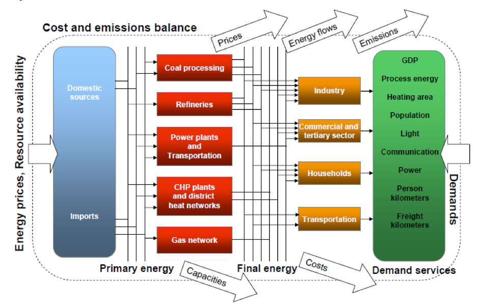

# Overview

TIAM-FR is the French version of the TIMES Integrated Assessment Model (TIAM), developed at the Centre for Applied Mathematics (CMA) of Mines Paris - PSL. TIAM is the global version of the TIMES family models developed under the Energy Technology System Analysis Program (ETSAP, 2021). The Integrated MARKAL-EFOM System (or TIMES) is the successor of two model 
paradigms known as MARKAL and EFOM, which respectively model market allocations and commodities fluxes and were developed in the early 1980s by 
ETSAP. TIMES is a generator of partial equilibrium techno-economic models representing the energy system of geographical areas (e.g. continents, regions, countries) on
a long-term horizon. It enables an assessment and discussion of the evolution of energy systems from a technological perspective and according
to climate policies (taxes, agreements, pledges, etc.). It has been used for a wide range of applications at the local level
(Andrade, 2022; Genave, 2021; Selosse et al., 2018), national level (Assoumou, 2006; Doudard, 2017; Millot et al., 2020),
continental level (Postic, 2015; Siggini, 2022), and global level (Boubault and Maïzi, 2019; Kang, 2017; Seck et al., 2022a; Selosse, 2019).  
As part of the TIMES model family, TIAM-FR is a linear programming partial equilibrium model. It is categorized as a bottom-up model because of 
its technology-rich description of the [energy system](../sectoral-coverage/index.md), depicting and tracking how energy is extracted, transformed, traded, and used in the world. The [demands](../demands/index.md) for energy, transportation and materials are given exogenously.

  
Fig. 1: TIMES structure

The model covers [15 regions](../spatial-representation/index.md) and project their energy system troughout the 21st century starting in 2018 with user-defined [milestone years and time slices](../time-representation/index.md). Different scenarios enable the user to explore how the global energy system could evolve optimally, i.e. by minimizing the cost of satisfying energy demands. The main results that can be discussed with TIAM-FR are 
+ the levels of GHG emissions, 
+ the primary energy use,
+ the final energy use,
+ the technologies processing final energy and satisfying energy demand,
+ interactions between processes,
+ the marginal cost of producing energy or material commodities,
+ the total cost of satisfying global energy demand.

## Optimization

In linear programming, an optimization problem consists in minimizing or maximizing an objective function which is expressed by decision variables subject to constraints. In TIAM-FR, the optimization problem determines the partial economic equilibrium  of the energy system, or the total discounted cost minimized over all periods of the model’s horizon, while respecting any technical, environmental, and policy constraints, represented in the matrix $B$ and vector $b$ of the following equation.

$$
\min c \cdot X
$$

$$
s.t. \forall t \in T, \forall i \in I, Q_{k,i} (t) \geq D_i (t)
$$

$$
B \cdot X \geq b
$$

Thus, the solver minimizes the total discounted cost $c$ of invesment decisions $X$ at each period $t$ and for all demands $i$, quch that the installed capcities $Q_{k,i}$ satisfy the exogenous demand for energy services $D_i$. The vector of variables include activity levels of technologies, total installed capacities of technologies, additional capacities, quantities of commodity consumed or produced within processes, quantities of commodities stored or discharged, quantities of commodities traded across regions.  
the objective function corresponds to the net present value $NPV$ of the total discounted cost of the energy system of each region $Cost_{r,t}$, which can be expressed as follows:

$$
NPV = \sum_r \sum_t (1+d_{r,t})^{BY-t} \cdot Cost_{r,t} 
$$

where $BY$ is the base year, which is 2018 in TIAM-FR.

In TIAM-FR, the linear program is formulated in GAMS (General Algebraic Modelling System) and solved with the linear programming optimizer CPLEX, by 
minimizing the total discounted cost of the energy system. 

For an exhaustive and comprehensive description of TIMES model, please consult the [ETSAP documentation part I](https://github.com/etsap-TIMES/TIMES_Documentation/blob/master/Documentation_for_the_TIMES_Model-Part-I.pdf), and for optimization problems in TIMES models please consult the [ETSAP documentation part II](https://github.com/etsap-TIMES/TIMES_Documentation/blob/master/Documentation_for_the_TIMES_Model-Part-II.pdf).

**References**

ETSAP, 2021. IEA-ETSAP | TIMES [WWW Document]. URL https://iea-etsap.org/index.php/etsap-tools/model-generators/times (accessed 7.5.21).  
Andrade, C., 2022. PROSPECTIVE ÉNERGÉTIQUE PACA ˸ Quelles transformations futures du territoire pour assurer une transition énergétique et d’économie circulaire?
Genave, A., 2021. Essays on energy vulnerability and energy transition in Small Island Developing States.  
Selosse, S., Ricci, O., Garabedian, S., Maïzi, N., 2018. Exploring sustainable energy future in Reunion Island. Utilities Policy 55, 158–166. https://doi.org/10.1016/j.jup.2018.10.006  
Assoumou, E., 2006. Modélisation MARKAL pour la planification énergétique long terme dans le contexte français (phdthesis). École Nationale Supérieure des Mines de Paris.  
Doudard, R., 2017. Flexibilité et interactions de long terme dans les systèmes multi-énergies: analyse technico-économique des nouvelles filières gazières et électriques en France.  
Millot, A., Krook-Riekkola, A., Maïzi, N., 2020. Guiding the future energy transition to net-zero emissions: Lessons from exploring the differences between France and Sweden. Energy Policy 139, 111358. https://doi.org/10.1016/j.enpol.2020.111358  
Postic, S., 2015. Modélisation prospective pour le secteur énergétique en Amérique du Sud - Application aux négociations climatiques internationales (These de doctorat). Paris, ENMP.  
Siggini, G., 2022. Approche intégrée pour l’analyse prospective de la décarbonisation profonde du système électrique européen à l’horizon 2050 face à la variabilité climatique.  
Boubault, A., Maïzi, N., 2019. Devising Mineral Resource Supply Pathways to a Low-Carbon Electricity Generation by 2100. Resources 8, 33. https://doi.org/10.3390/resources8010033  
Kang, S., 2017. La place de la bioénergie dans un monde sobre en carbone: Analyse prospective et développement de la filière biomasse dans le modèle TIAM-FR. MINES ParisTech.
Seck, G.S., Hache, E., Barnet, C., 2022. Potential bottleneck in the energy transition: The case of cobalt in an accelerating electro-mobility world. Resources Policy 75, 102516. https://doi.org/10.1016/j.resourpol.2021.102516  
Selosse, S., 2019. Bioenergy with carbon capture and storage: how carbon storage and biomass resources potentials can impact the development of the BECCS, in: Bioenergy with Carbon Capture and Storage. Elsevier, pp. 237–256. https://doi.org/10.1016/B978-0-12-816229-3.00012-0  
