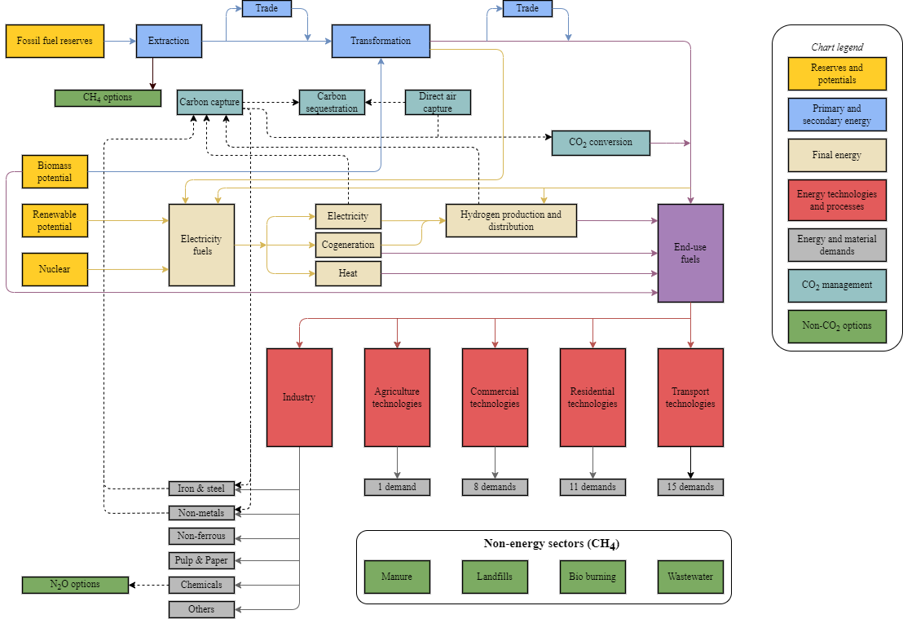

# Sectoral coverage

In TIAM-FR, the RES network links primary energy extraction and renewable energy potentials around the world to transform them into final energy that satisfies the energy demand of five sectors,
*i.e.* the agriculture, commercial, residential, transport, and industry sectors. The technologies can be primary sources of energy (extraction processes), activity processes (power plants, 
factories, refineries, end-use devices such as cars and heating systems), or inter-regional exchange (IRE) used for trading commodities between regions. The commodities can be energy carriers 
(electricity, heat, fossil fuels, etc.), energy services (light duty transport, lighting needs, agriculture energy demand, etc.), materials (cement, steel, etc.), or GHG emissions (CO<sub>2</sub>, CH<sub>4</sub>, and N<sub>2</sub>O). Figure 13 displays a synthetic view of the RES of TIAM-FR.



```{toctree}
---
titlesonly:
glob:
---
CO2-accounting
*
```

