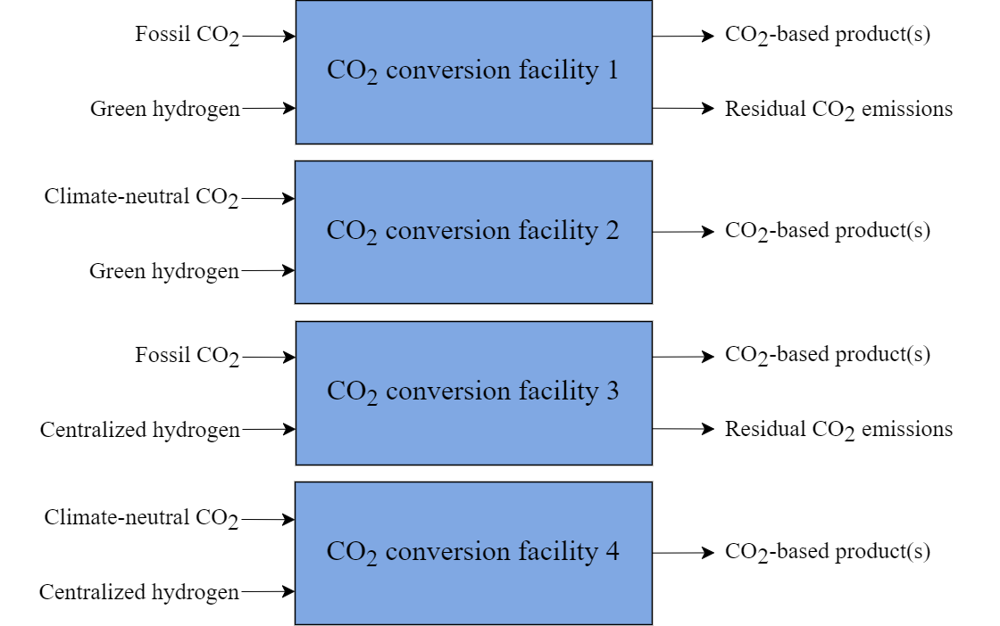

# CO2 utilization

The technological options for CO2 utilization in TIAM-FR encompasses 4 routes:
+ hydrogenation of CO2 into methanol
+ methanaton of CO2 into methane
+ Fischer-Tropsch process into a range of synthetic fuels
+ mineralization of CO2

For routes converting CO2 into synthetic fuels, several designs are implemented depending on the nature of the CO2 processed and the type of hydrogen, i.e. either generated by dedicated variable renewable assets or centralized electricity. Concerning the nature of CO2, we distinguish fossil and process CO2 from biogenic and atmospheric CO2. As hydrogen is not involved in the mineralization of CO2, only the nature of CO2 processed in differentiated.

Fig. 1: Different designs for CO2 utiliation in TIAM-FR

As it is assumed that 90% of the CO2 processed is actually converted, residual emissions are accounted for 1% of the CO2 flow in the case where fossil CO2 is employed. For processes convertin CO2 into synthetic fuels, capacity designs are assumed to a commercial capacity of 11.2 PJ/y (Winchester et al., 2013). All CO2 utilization processes are commercially available as of 2030.

## Hydrogenation

Methanol (CH₃OH or MeOH) is an alcohol used as a fuel for transportation demands such as buses, heavy trucks, light trucks, and cars. The main process to generate methanol is to make CO2 react with H2, also yielding water as a by-product:

$$
CO_2+3H_2↔CH_3 OH+H_2O
$$

The techno-economic assumptions for this processes are taken from Zhang et al. (2019) and summarized in Table 1.

Tab. 1: Techno-economic properties of the hydrogenation process in TIAM-FR
|Properties|Units|Values|
|----------|-----|------|
|Hydrogen efficiency|J/J|1.08|
|CO2 efficiency|g/J|75.4|
|CAPEX|$/GJpa|20|
|Fixed O&M|$/GJpa|0.7|
|Availability factor||90%|
|Life|years|20|
|Discount rate||8%|

The techno-economic assumptions for CO2 capture can be found in sections related to [the power sector](power-sector.md), [biofuels](biofuels.md), [industry](industry.md), and [direct air capture](dac.md). The techno-economic assumptions for hydrogen supply can be found [here](hydrogen.md).  

Besides, methanol turned into gasoline through the so-called Methanol-to-Gasoline (MtG) process for which liquified petroleum gas (LPG) and electricity are co-products. Likewise, the MtG process can employ fossil-based or climate-neutral methanol. The techno-economic assumptions for this process are extrated from Hennig and Haase (2021) and summarized in Table 2:

Tab. 2: Techno-economic properties of Methanol-to-Gasoline in TIAM-FR (Henning and Haase, 2021)
|Properties|Units|Values|
|----------|-----|------|
|Gasoline yield|J/J|0.52|
|LPG yield|J/J|0.40|
|Electricity generation|J/J|0.1|
|CAPEX|$/GW|5|
|Fixed O&M|$/GW|0.04|
|Availability factor||90%|
|Life|years|15|
|Discount rate||7%|

In TIAM-FR, methanol is only modeled as an energy carrier, not as a chemical good. The energy demand for methanol as a chemical is implicitly modeled and included in the overall energy demand of the chemical industry.  

## Methanation
Methanation is a process turning CO2 and H2 into synthetic CH4 through the following reaction:
$$
CO_2+4H_2↔CH_4 OH+H_2O
$$

The synthetic methane can be utilized in end-use processes to substitute for natural gas. The techno-economic properties of methanation processes implemented in TIAM-FR are taken from Chauvy et al. (2021) and summarized in Table 3.

Tab. 3: Techno-economic properties of methanation processes in TIAM-FR (Chauvy et al., 2021)
|Properties|Units|Values|
|----------|-----|------|
|CO2 input|kg/GJ|50.5|
|Hydrogen input|J/J|1.2|
|Electricity consumption|J/J|0.002|
|Excess heat|J/J|0.18|
|CAPEX|$/GW|86.5|
|Fixed O&M|$/GW|6.5|
|Availability factor||90%|
|Life|years|20|
|Discount rate||8%|

## Fischer-Tropsch

## Mineralization

## References

Winchester, N., McConnachie, D., Wollersheim, C., Waitz, I., 2013. Market Cost of Renewable Jet Fuel Adoption in the United States (No. 238). MIT Joint Program on the Science and Policy of Global Change.
