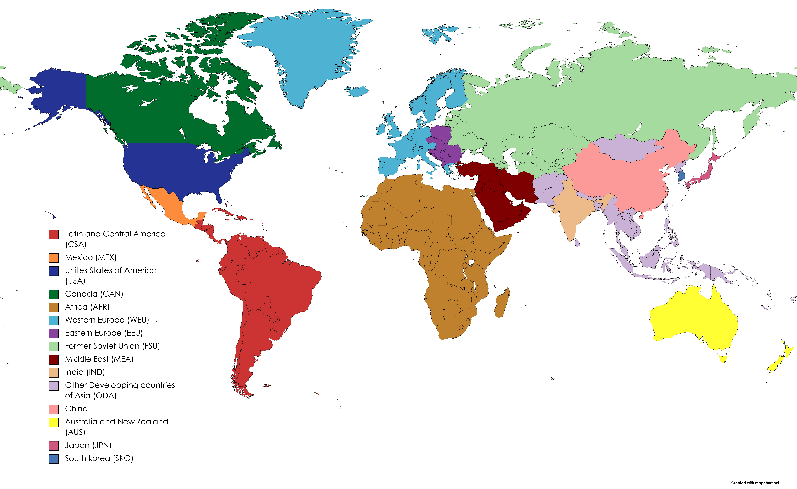

# Spatial representation

TIAM-FR is a global energy model divided into fifteen regions. Figure 1 shows the disaggregatetion of regions with their labels in the legend. This disaggregation comprises 7 countries (USA, Canada, Mexico, China, India, South Korea, and Japan); some regions like Africa and Latin and Central America are highly aggregated, mainly due to a lack of national data for these regions and for simplicity. [Energy trades](../trades/index.md) are modeled between these regions, including crude oil, natural gas, liquefied natural gas (LNG), coal, bioenergy, and hydrogen. 

Fig. 1: Regional disaggregation of TIAM-FR

For each region, specific socio-economic parameters are associated reflecting the cost of capital and labor (Table 1), along with the [energy resources](../energy-sectors/index.md) available in the base year.

Table 1: Region-specific capital and labor scalars in TIAM-FR
|       |AFR |AUS |CAN |CHI |CSA |EEU |FSU |IND |JPN |MEA |MEX |ODA |SKO |USA |WEU |
|-------|----|----|----|----|----|----|----|----|----|----|----|----|----|----|----|
|Capital|1.25|1.2 |1.0 |0.9 |1.25|1.0 |1.25|0.9 |1.4 |1.25|1.0 |1.25|1.0 |1.0 |1.1 |
|Labor  |0.7 |0.8 |1.0 |0.6 |0.7 |0.7 |0.7 |0.6 |1.0 |0.7 |0.8 |0.6 |0.8 |1.0 |0.9 |

