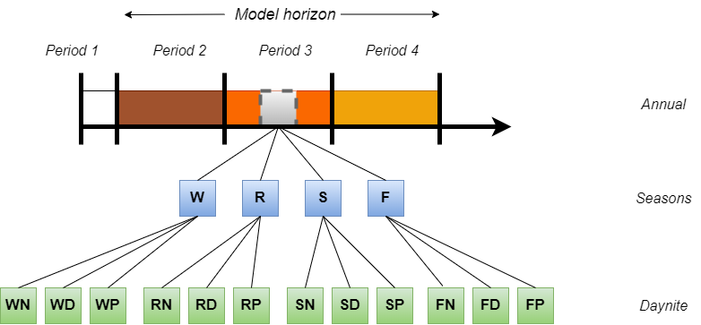

# Time representation

The base year of TIAM-FR is 2018. The model projects the world energy system until 2100 and solves the optimization problem at the convenience of the user. The model is disaggregated into several periods over the time horizon (Figure 1). First, the model horizon is divided into periods called *milestone years* for which investment and activity decisions are chosen by the model to run the energy system at a particular year in the middle of each period, and they evolve linearly between the successive milestone years. These milestone years are divided into seasons (winter *W*, spring *R*, summer *S*, and fall *F*) to represent the time variability of energy demands and energy potentials over seasons. Furthermore, seasons are divided into so-called “time slices” defined as portions of the days (*D*), nights (*N*), and peak demands (*P*). This representation is useful to consider the intermittency of some renewable energies as well as the satisfaction of the crucial peak energy demand at some moments of a day, depending on the region and sector.

  
Fig. 1: Representation of time in TIAM-FR
