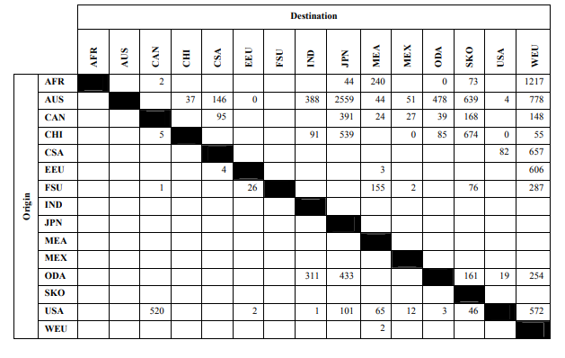
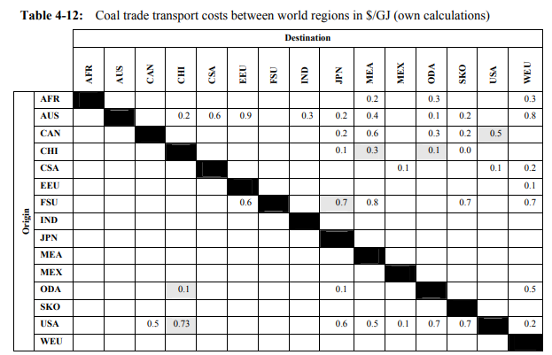

# Coal trades

Coal trades are estimated from (Remme et al. 2007) to remain constant in terms of volume and cost until 2018.

Table 1: Global inter-regional net coal trade (steam coal and coking coal) between world regions

Table 2: Coal trade transport costs between world regions in $/GJ (

**Reference**

Remme, U., Blesl, M., Fahl, U., 2007. Global resources and energy trade: An overview for coal, natural gas, oil and uranium.
