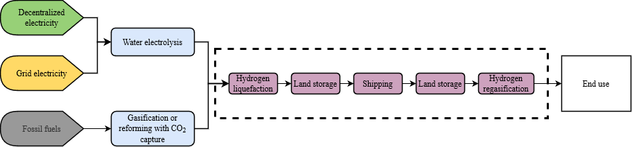

# Hydrogen

As some regions in the world have higher renewable potentials than others, other regions with high energy demand but low potential could import low-carbon hydrogen. In particular, several studies have looked at how to generate low-carbon hydrogen in Australia (Alkhaledi et al., 2022; Johnston et al., 2022; Raab et al., 2021), Latin America (Heuser et al., 2019), Africa (Niermann et al., 2021), and the Middle East, and how to ship it to future hydrogen economies such in Japan, South Korea and Europe. These regions and countries in the Northern Hemisphere are keen to use hydrogen to decarbonize their energy consumption, but are faced with relatively low renewable potentials. Thus, for the four aforementioned regions, and these three consumption regions, it is estimated in Table 1 below the cost of trading hydrogen including liquefaction and regasification processes, and land storage (Figure 1).

Figure 1: Hydrogen value chain from production to consumption. The dashed rectangle encircling the purple blocks refers to the scope of the modelling.

Shipping gaseous hydrogen requires huge volume, high-pressure storage tanks due to the low density of gaseous hydrogen. Liquefying hydrogen at very low pressures and temperatures increases the hydrogen density by 790 times (71 kg/m3) compared to its gaseous phase at normalized atmospheric pressure (0.0899 kg/Nm3), and by about 1.7 times compared to its gaseous phase at 700 bars (42.1 kg/m3). A liquefaction process consists of three main stages: precooling, cryogenic, and liquefying. The first two stages are combined with compressors, expanders, condensers, and heat exchangers. These are energy-intensive stages consuming roughly 12 kWh/kgH2 (Heuser et al., 2019). After liquefaction, temporary storage should be considered as the ship may not be ready to load the liquid hydrogen right away. Storage consists of on-land tanks, including a pump that transfers the liquid hydrogen to the ship, and a compressor that sends the so-called boil-off gases (BOG) to the liquefier. These BOG are hydrogen gaseous losses that occur due to the difference in pressure between the tank and the atmosphere. This process requires approximately 0.2 kWh/kgH2 (Ishimoto et al., 2020). Once loaded into cryogenic tanks onboard, the liquid hydrogen is shipped to another place. It is assumed that future commercial projects will feature a capacity of 80,000 m3, with an average speed of 16 knots, operating 8,000 hours per year. Initially, these ships would be fueled with heavy fuel oil (HFO), but we assume that BOG will be recovered when advanced technologies are available in 2035. Consequently, in 2035, the emissions due to shipping are considered null.

Table 1: Main technical assumptions
| **Attribute**                                  | **Value** | **Unit**      |
| ---------------------------------------------- | --------- | ------------- |
| **Hydrogen carrier capacity**                  | 80,000    | m3 |
| **Boil-off gas (BOG) production rate per day** | 0.2       | %/day         |
| **Maximum storage rate to ship tank capacity** | 98        | %             |
| **Minimum storage rate to ship tank capacity** | 4         | %             |
| **Shipping speed**                             | 16        | knots/h       |
| **Annual operating hours of shipping**         | 8,000     | hours         |

Once it has arrived at destination, the liquid hydrogen is buffered again in a storage tank before being regasified. The regasification process consists in pumping, heating and expanding the gas to the desired pressure (1.7 bar). This requires around 2,9 kWh/kgH2  of electricity (Laouir, 2019).
The costs of liquefaction, shipping, land storage, and regasification are shown in Table 2 below, with their respective references.

Table 2: Techno-economic properties of the hydrogen value chain
| **Process**        | **Reference**           | **Attribute**     | **Value** | **Unit** |
| ------------------ | ----------------------- | ----------------- | --------- | -------- |
| **Liquefaction**   | (Raab et al., 2021)     | Electricity input | 0.006     | PJ/PJ    |
| CAPEX              | 29.42                   | €/GJH2_a          |
| FIXOM              | 0.588                   | €/GJH2            |
| VAROM              | 1.004                   | €/kgH2            |
| **Shipping**       | (Niermann et al., 2021) | CAPEX             | 4.981     | $/GJ_a   |
| FIXOM              | 0.100                   | $/GJ_a            |
| **Regasification** | (DNV-GL, 2020)          | Electricity input | 0.087     | PJ/PJ    |
| CAPEX              | 0.010                   | €/GJ_a            |
| FIXOM              | 0.003                   | €/GJ_a            |
| VAROM              | 0.145                   | €/kg              |
| **Land storage**   | (Raab et al., 2021)     | Electricity input | 0.360     | PJ/PJ    |
| CAPEX              | 3.277                   | €/GJH2_a          |
| FIXOM              | 0.083                   | €/GJH2_a          |

Concerning the efficiency and variable cost of shipping, these depend on the shipping distance. Indeed, the longer hydrogen travels, the more losses occur, which affects the transport efficiency and the energy efficiency (in terms of HFO input per H2 output), which in turn affects the emissions and the variable costs. 
In terms of modelling, we consider shipping hydrogen: 
+	from Australia (Melbourne) to Japan (Kobe), South Korea (Busan), and Western Europe (Rotterdam);
+	from Latin America (Valparaiso) to Japan (Kobe) and Western Europe (Rotterdam); and
+	from the Middle-East (Dubai) to Western Europe (Rotterdam).

The distances were taken from a website estimating shipping distances from one port to another (SEA-DISTANCES.ORG, 2022). We assume that hydrogen shipping is available starting from 2025, and that BOG recovery is available from 2035 onwards, avoiding fossil emissions from HFO combustion.

# References
Alkhaledi, A.NFNR., Sampath, S., Pilidis, P., 2022. Economic analysis of a zero-carbon liquefied hydrogen tanker ship. International Journal of Hydrogen Energy 47, 28213–28223. https://doi.org/10.1016/j.ijhydene.2022.06.168  
Johnston, C., Ali Khan, M.H., Amal, R., Daiyan, R., MacGill, I., 2022. Shipping the sunshine: An open-source model for costing renewable hydrogen transport from Australia. International Journal of Hydrogen Energy 47, 20362–20377. https://doi.org/10.1016/j.ijhydene.2022.04.156  
Raab, M., Maier, S., Dietrich, R.-U., 2021. Comparative techno-economic assessment of a large-scale hydrogen transport via liquid transport media. International Journal of Hydrogen Energy 46, 11956–11968. https://doi.org/10.1016/j.ijhydene.2020.12.213  
Heuser, P.-M., Ryberg, D.S., Grube, T., Robinius, M., Stolten, D., 2019. Techno-economic analysis of a potential energy trading link between Patagonia and Japan based on CO2 free hydrogen. International Journal of Hydrogen Energy, Special Issue on Selected Contributions from the European Hydrogen Energy Conference 2018. Málaga, Spain. March 14th - 16th 44, 12733–12747. https://doi.org/10.1016/j.ijhydene.2018.12.156  
Niermann, M., Timmerberg, S., Drünert, S., Kaltschmitt, M., 2021. Liquid Organic Hydrogen Carriers and alternatives for international transport of renewable hydrogen. Renewable and Sustainable Energy Reviews 135, 110171. https://doi.org/10.1016/j.rser.2020.110171  
Ishimoto, Y., Voldsund, M., Nekså, P., Roussanaly, S., Berstad, D., Gardarsdottir, S.O., 2020. Large-scale production and transport of hydrogen from Norway to Europe and Japan: Value chain analysis and comparison of liquid hydrogen and ammonia as energy carriers. International Journal of Hydrogen Energy 45, 32865–32883. https://doi.org/10.1016/j.ijhydene.2020.09.017  
Laouir, A., 2019. Performance analysis of open-loop cycles for LH2 regasification. International Journal of Hydrogen Energy 44, 22425–22436. https://doi.org/10.1016/j.ijhydene.2018.12.204  
SEA-DISTANCES.ORG, 2022. SEA-DISTANCES.ORG - Distances [WWW Document]. URL https://sea-distances.org/ (accessed 11.15.22).
